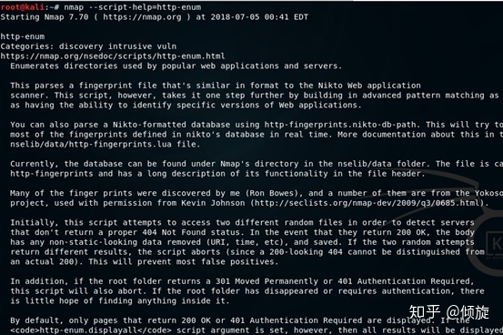
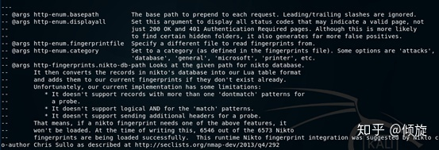

## 0x00 前言

PS ：如果你不知道你是否需要学习这个技术，那么我可以先告诉你Nmap能够做什么：

- 网络结构画像
- 漏洞扫描
- 漏洞利用
- 端口扫描
- 爬虫
- 信息搜集
- ....

我的分类不是很清晰，但是对于一个渗透测试人员、运维人员、甲、乙方的工程师都会需要它的定制化功能，例如：将扫描结果写到数据库？新的漏洞出了POC，客户需要立即进行漏洞扫描？

导出扫描结果这个问题，Nmap官方做出如下回应：

> [Nmap Network Scanning](https://link.zhihu.com/?target=https%3A//nmap.org/book/output-formats-output-to-database.html)

> 一个共同的愿望是将Nmap结果输出到数据库以便于查询和跟踪。这允许用户来自个人渗透测试仪 到国际企业存储他们的所有扫描结果并轻松比较它们。企业可能每天运行大型扫描，并为新打开的端口或可用计算机的邮件管理员安排查询。渗透测试人员可能会了解新漏洞并搜索受影响应用程序的所有旧扫描结果，以便他可以警告相关客户端。研究人员可以扫描数百万个IP地址，并将结果保存在数据库中，以便进行实时查询。

> 虽然这些目标值得称赞，但Nmap不提供直接的数据库输出功能。我不仅有太多不同的数据库类型支持它们，而且用户的需求变化如此之大，以至于没有单一的数据库模式是合适的。企业，笔测试员和研究人员的需求都需要不同的表结构。

而很多朋友大多都是使用Python来调用Nmap进行格式解析，这种方式无法预估扫描进度，不能进行状态交互，效率很差，如果我们需要一个实时进行独写、漏洞检测等定制化的操作，那么就可以跟我一起来学习如何写一个自己的Nmap脚本，这本书涵盖的知识比较多，会涉及安全、网络协议、编程技术这些相关知识，相信你能够收获很多。

笔者写扩展脚本开发系列的初衷是让大家了解nmap这个优秀的开源工具的功能，解决一些定制化的扫描需求。

在开始之前，需要读者具备：能够熟练使用Nmap进行端口扫描、了解Nmap目录结构、懂得常见的网络知识、**Lua基础（如果需要的话，我会在后期铺垫）**。

## 0x02 Nmap扩展脚本分类

* auth	处理身份验证
* broadcast 网络广播
* brute	暴力猜解
* default	默认
* discovery	服务发现
* dos	拒绝服务
* exploit	漏洞利用
* external	外部扩展
* fuzzer	模糊测试
* intrusive	扫描可能造成不良后果
* malware	检测后门
* safe	扫描危害较小
* version	版本识别
* vuln 漏洞检测

## 0X03 Nmap扩展脚本铺垫

相信网上已经有很多文章去写如何使用扩展脚本了，这块我不准备过多的铺垫。

主要介绍如下几点：

* Nmap扩展脚本用途
* Nmap扩展脚本使用方法
* 如何查看Nmap扩展脚本的Usage（使用方法）

### 0X03 Nmap扩展脚本用途

Nmap扩展脚本能够帮助我们实现更多定制化的需求扫描、结果的处理、漏洞的检测、漏洞的利用等。在0x02中已经列出了扩展脚本的分类，根据说明我们能理解一个大概，这些分类代表了Nmap各个方面的能力。

### 0x03 Nmap扩展脚本使用方法

在很早之前，我写过一篇科普文章，主要介绍了Nmap的脚本分类、使用方法，链接：

http://zhuanlan.zhihu.com/p/26618074

本章没有太多概念性的东西，希望读者能够边看边做。首先设定一个需求，我有一个需要搜集某个IP或某组IP所有开放HTTP服务的中间件信息。那么Nmap有一个脚本是可以直接满足我们需求的：

`http-server-header.nse`

扫描命令：`nmap --script=http-server-header <TARGET>`

例如我需要扫描192.168.85.132的HTTP服务的中间件信息，使用Nmap时需要输入以下命令：

`nmap --script=http-server-header 192.168.85.132`

执行结果如下：

从扫描结果可以看出，在扫描到80端口的开放状态及服务名称下方会输出关于http-server-header脚本的结果：Apache/2.4.29 (Debian)

一般情况下，在nmap安装目录下有一个scripts文件夹，里面存放了很多供我们调用的脚本，脚本的语言是lua，文件扩展名是nse。使用脚本时我们不需要输入脚本的全名，例如，调用http-server-header.nse时，只需要输入文件名http-server-header即可。

下面介绍一些带参数的扩展脚本使用方法。同样的，设定一个需求，我需要扫描192.168.85.132的HTTP服务下有哪些目录或者文件，那么可以采用http-enum.nse脚本。

**http-enum.nse用于枚举http服务下的目录或文件**

但是单单使用这个脚本，而不根据实际情况设定内置参数，结果可能并不理想。这个脚本有一些参数：

* http-enum.basepath 开始目录
* http-enum.displayall 是否显示全部（默认HTTP状态码200显示，401不显示）
* http-enum.fingerprintfile 指定其他文件，从中读取指纹
* http-enum.category 设置类别（'attacks','database', 'general', 'microsoft', 'printer'）
* http-fingerprints.nikto-db-path 指定nikto数据库的路径

假设要从admin目录开始进行枚举，需要输入如下命令：

`nmap --script=http-enum --script-args 'http-enum.basepath=admin'
192.168.85.132`

### 0X03 如何查看Nmap扩展脚本的Usage（使用方法）

使用--script-help参数

`nmap --script-help=http-enum`

直接查看脚本文件

`cat /usr/share/nmap/scripts/http-enum.nse`

下一章：扩展脚本（NSE引擎）执行规则