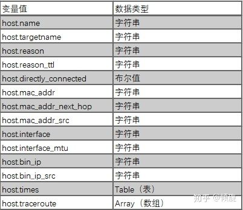
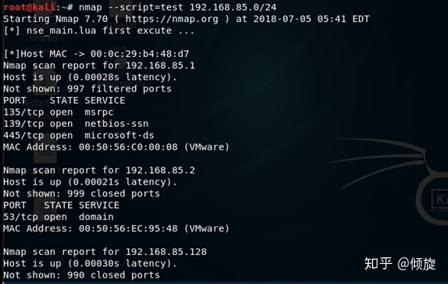
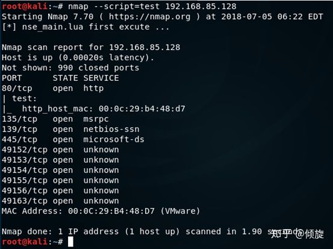
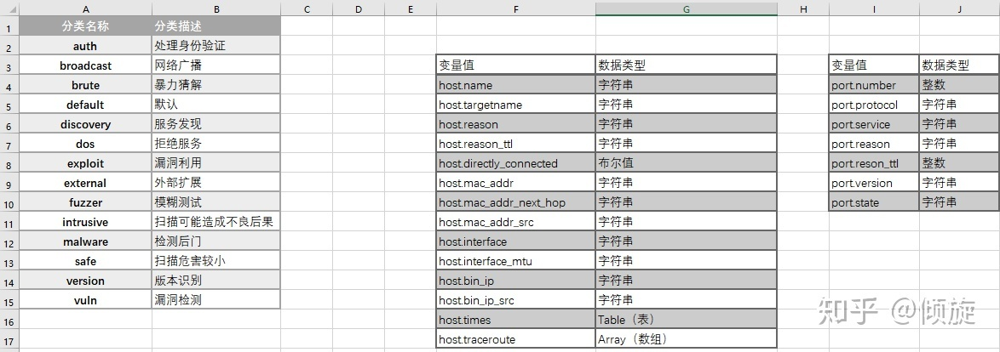

## 0X01 扩展脚本对象-主机


在进行主机扫描的时候会执行hostrule这个函数，从以往的nmap扩展脚本代码中我们都可以发现在hostrule这个函数中做了一些针对host操作的动作。

hostrule有一个参数，变量名叫host，我们可以把它理解为一个对象，在这里称之为对象是为了方便读者理解，在lua中实际它的数据类型是一个多维的table（表），具有很多属性。由于这些rule函数都是被动调用的，我们只能在函数内部对形参进行操作了。

参考：https://nmap.org/book/nse-api.html



通过上面这个表格我们能够清楚的了解到从host这个table中可以读取到哪些信息。

为了让读者吸收，建立一个需求，请大家与我一起完成。

> 需求：使用Nmap扫描获得所有主机的MAC地址

由于Nmap没提供这个需求的解决方案，就需要我们自己来写一个扩展脚本了~

还是拿之前的test.nse来改一下：

```lua
local stdnse = require "stdnse"
prerule=function()
end
hostrule=function(host)
	mac = host.mac_addr
        print(stdnse.format_mac(mac))
end
portrule=function(host,port)
end
action=function()
end
postrule=function()
end
```

通过host.mac_addr获取的mac地址是二进制编码的，我们要转换成字符串，需要引入stdnse这个扩展包，stdnse包中有一个format_mac函数，能够将host.mac_addr转换成字符串。

执行效果如下：


```
00:50:56:ec:95:48
00:50:56:f8:1e:b8
00:50:56:c0:00:08
00:0c:29:b4:48:d7
```

以上这些MAC地址就是当前内网中的所有主机了。

## 0X02 扩展脚本对象-端口

端口相对于主机来说，属性较少，主要是针对端口状态、端口协议、端口服务、端口服务版本的一些描述。


### 0X02 完成一个需求

还是老样子，假设一个需求，解决这个需求：

> 需求：获取当前内网中开放HTTP服务的主机的MAC地址


首先可以分析一下这个需求：

>条件：开放了HTTP服务
>开放了HTTP服务的主机一般都会开放80/443
>目的：获取MAC地址
>需要引入stdnse包，调用format_mac函数

如此一来思路清晰了许多，还是从test.nse改起：

```lua
local stdnse = require "stdnse"
prerule=function()
end
hostrule=function(host)
end
portrule=function(host,port)
	if(port.number == 80 or port.number == 443)then
		print("[*]Host MAC -> " .. stdnse.format_mac(host.mac_addr))
	end
end
action=function()
end
postrule=function()
end
```

既然是针对服务/端口的需求，我们可以在portrule中进行编写，肯定有读者会产生疑问，nmap的-p参数就能指定端口，为何还要再portrule中判断。

是因为我们最终写的脚本可能不只是做这一件事，而是做多件事情，以不同的条件限定它去执行哪些代码。

扫描结果：



通过上面的扫描，我们获得了内网中开启HTTP服务的主机的MAC地址，虽然Nmap已经给出了，但是学习都是一步一步来的，后面还有更复杂的需求等着你呢！

## 0x03 优化输出格式——表（table）

在stdnse包中有一个函数叫output_table()，它能够返回一个table数据类型，通过操作这个table，将Key->Value的对应关系数据或列表数据放入，再return，就可以输出漂亮的格式~

就拿0x01中的test.nse来演示：

```lua
local stdnse = require "stdnse"
http_table = stdnse.output_table()
prerule=function()
end
hostrule=function(host)
end
portrule=function(host,port)
	if(port.number == 80 or port.number == 443)then
		http_table.http_host_mac = stdnse.format_mac(host.mac_addr)
		return true
	end
end
action=function()
	return http_table
end
postrule=function()
end
```

执行效果如下：



可见在portrule返回true的时候才会执行action函数，在脚本刚开始执行前，声明了一个http_table全局变量，当遇到端口80/443时，会把当前主机的MAC地址装入http_table，在action中返回。


对象结构图：



下一章：HTTP包的使用

会介绍HTTP包的使用，并且会教大家写一些批量检测HTTP协议相关的漏洞脚本，例如：CVE-2017-12615

