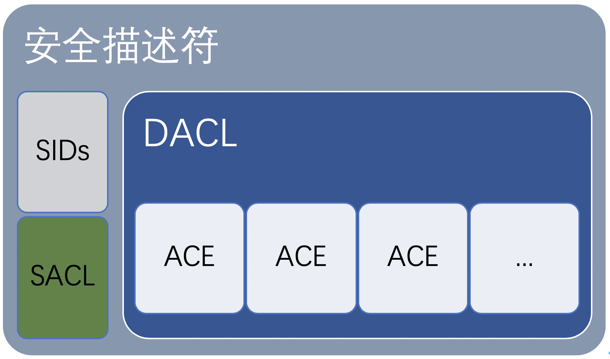
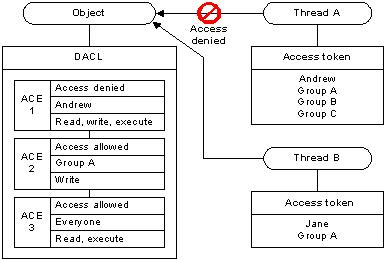
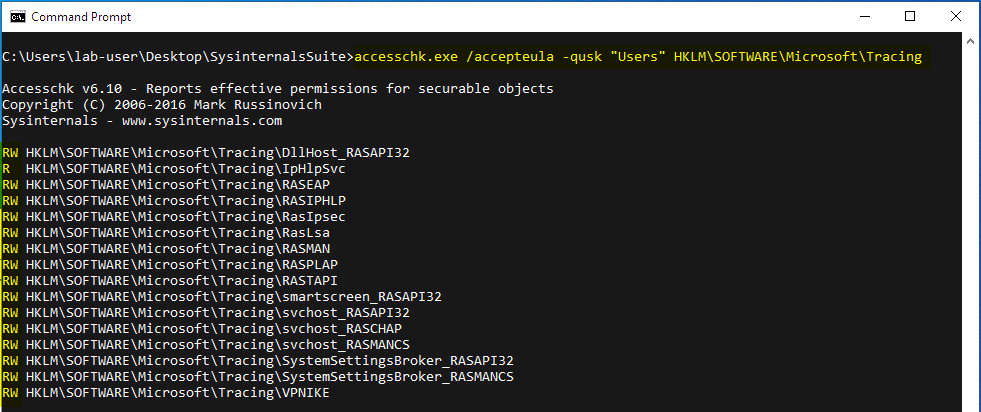
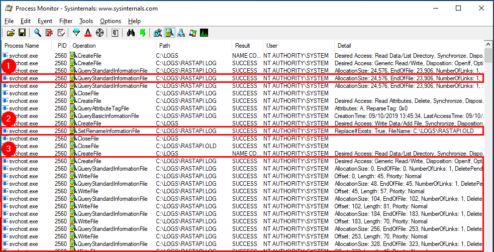
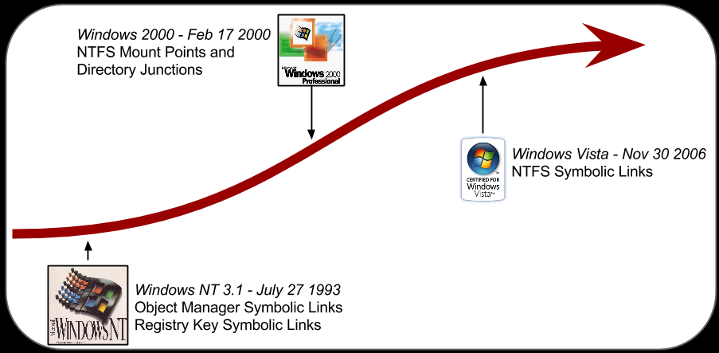

## 0X01 Windows 特权提升漏洞分类

Windows 特权提升相信大家已经不陌生了，常见的场景如：NETWORK SERVICE → SYSTEM

但从漏洞原理去了解，会发现利用漏洞利用本就是一个“使程序逻辑不按照正常方向运转”的过程。

许多需要构建多个苛刻条件的Windows底层漏洞发现绝非偶然，也有许多Windows漏洞的发现是纯属偶然，它们是那么的容易可以利用，并且危害巨大。

从研究成本，我根据自己的理解将Windows漏洞分为以下几类：

1. Windows内核、服务的底层漏洞（需要长时间的Fuzz跟踪以及很深厚的基础知识）
2. Windows服务、相关软件生态的权限控制不当产生的漏洞
3. Windows开发者自己本身都未想到过的逻辑漏洞

以上3种可能是一个不严谨的分类，但作为一个理解铺垫是足够了。

## 0X02 权限（特权）与进程的关系 - 访问控制模型

访问控制模型有两个主要的组成部分，访问令牌（Access Token）和安全描述符（Security Descriptor），它们分别是访问者和被访问者拥有的东西。通过访问令牌和安全描述符的内容，Windows可以确定持有令牌的访问者能否访问持有安全描述符的对象。

访问令牌是与特定的Windows账户关联的。**当一个Windows账户登录的时候，系统会从内部数据库里读取该账户的信息，然后使用这些信息生成一个访问令牌。在该账户环境下启动的进程，都会获得这个令牌的一个副本，进程中的线程默认持有这个令牌。线程要想去访问某个对象，或者执行某些系统管理相关的操作时，Windows就会使用这个线程持有的令牌进行访问检查。**


安全描述符是与被访问对象关联的，它含有这个对象所有者的SID，以及一个访问控制列表（ACL，Access Control List），访问控制列表又包括了DACL（Discretionary Access Control List）和SACL（System Access Control List）——目前还不知道这两个东西的确切翻译——其中，**DACL是安全描述符中最重要的，它里面包含零个或多个访问控制项（ACE，Access Control Entry），每个访问控制项的内容描述了允许或拒绝特定账户对这个对象执行特定操作。**至于SACL，它很少用到，主要是用于系统审计的，它的内容指定了当特定账户对这个对象执行特定操作时，记录到系统日志中。

如文件，点击右键选择“属性”，找到“安全”选项卡，点击“高级”按钮。弹出的对话筐中，“权限”选项卡就是DACL，"审核"选项卡是SACL，“所有者”是Owner、Group。

访问令牌中主要含有以下的内容：

- 当前登录账户的SID，也就是与令牌关联的账户的SID
- 当前登录账户所属的账户组的SID列表
- 受限制的SID（Restricted SID）列表
- 当前登录账户以及它所属账户组的权限（Privileges）列表

SID（Security Identity）是Windows中每个账户和账户组都有的一个标识符，平常我们看到的Administrator，Users等账户或者账户组在Windows内部是使用SID来标识的。例如S-1-5-21-1004336348-1275210071-725345543-1003就是一个完整的SID。每个SID在同一个系统中都是唯一的。

再来看看安全描述符中ACE的具体内容：

1. 特定账户或者账户组的SID；
2. 一个访问掩码（Access Mask），该掩码指定了具体的访问权限（Access Rights），也就是可以对该对象执行的操作；
3. 一个位标记，指示了这个ACE的类型；
4. 一组位标记，指示了安全描述符所属对象的子对象是否继承这个ACE；

所有的可访问对象都有三种ACE，分别是Access-denied ACE，Access-allowed ACE，System-audit ACE。Access-denied ACE用于拒绝账户访问，Access-allowed ACE用于允许账户访问，而System-audit ACE用于SACL中。

*当一个线程尝试去访问一个对象时，系统会检查线程持有的令牌以及被访问对象的安全描述符中的DACL。如果安全描述符中不存在DACL，则系统会允许线程进行访问。*

 


如果存在DACL，系统会顺序遍历DACL中的每个ACE，检查ACE中的SID在线程的令牌中是否存在。

当满足以下条件时，遍历会终止：

某个Access-denied ACE中的SID在线程令牌中存在，而且该ACE中的权限与线程要求的权限相符，此时系统拒绝该线程访问对象。

某个Access-allowed ACE中的SID在线程令牌中存在，而且该ACE中的权限与线程要求的权限相符，此时系统允许线程访问对象。所有ACE中的SID在线程令牌中均不存在，此时系统拒绝线程访问对象。

下图是转自MSDN的，Object对象的DACL中含有三个ACE：

1. 第一个ACE拒绝Andrew账户对Object进行读取，写入和执行操作；
2. 第二个ACE允许Group A账户组中的所有账户对Object进行写入操作；
3. 第三个ACE允许任何账户对Object进行读取和执行操作；



线程A试图访问Object，在遍历DACL的时候，遇到第一个ACE，满足上述的条件，遍历终止，线程A被拒绝访问Object，尽管线程A的访问令牌中含有Group A账户组的SID，并满足第二个ACE。同理，第三个ACE也没有被检查。对于线程B的分析是一样的，这里就不啰嗦了。可见ACE的排列顺序对线程能否访问对象是很重要的。

前面在介绍访问令牌的内容时，提到一个“受限制的SID列表”，对于这个东西，我曾经迷惑了很久，始终搞不懂它是干什么用的。经过一些实验之后，猜出了它的用途，尽管不一定对，这里简单说一下。

当一个访问令牌中含有受限制的SID列表时，系统在遍历ACE的时候只会与这些受限制的SID进行匹配，而忽略令牌中其余的SID，也就是相当于从访问令牌中删除了其它的SID。

另外，还有令牌中的权限列表，权限与对象访问无关，所以与安全描述符，SID等无关。当线程执行一些管理相关的操作时，系统会检查该线程的令牌中是否含有特定的权限，如果有，则允许线程执行该操作，否则拒绝。要查看完整的权限列表，可以运行gpedit.msc，然后定位到“计算机配置-Windows设置-安全设置-本地策略-用户权利指派”。

 — 引自：[Zplutor's](https://www.cnblogs.com/zplutor/archive/2010/01/05/1639892.html)

令牌结构：

```
 lkd> **dt nt!_token**
       +0x000 TokenSource      : _TOKEN_SOURCE
       +0x010 TokenId          : _LUID
       +0x018 AuthenticationId : _LUID
       +0x020 ParentTokenId    : _LUID
       +0x028 ExpirationTime   : _LARGE_INTEGER
       +0x030 TokenLock        : Ptr32 _ERESOURCE
       +0x038 AuditPolicy      : _SEP_AUDIT_POLICY
       +0x040 ModifiedId       : _LUID
       +0x048 SessionId        : Uint4B
       +0x04c UserAndGroupCount : Uint4B
       +0x050 RestrictedSidCount : Uint4B
       +0x054 PrivilegeCount   : Uint4B
       +0x058 VariableLength   : Uint4B
       +0x05c DynamicCharged   : Uint4B
       +0x060 DynamicAvailable : Uint4B
       +0x064 DefaultOwnerIndex : Uint4B
       +0x068 UserAndGroups    : Ptr32 _SID_AND_ATTRIBUTES
       +0x06c RestrictedSids   : Ptr32 _SID_AND_ATTRIBUTES
       +0x070 PrimaryGroup     : Ptr32 Void
       +0x074 Privileges       : Ptr32 _LUID_AND_ATTRIBUTES
       +0x078 DynamicPart      : Ptr32 Uint4B
       +0x07c DefaultDacl      : Ptr32 _ACL
       +0x080 TokenType        : _TOKEN_TYPE
       +0x084 ImpersonationLevel : _SECURITY_IMPERSONATION_LEVEL
       +0x088 TokenFlags       : Uint4B
       +0x08c TokenInUse       : UChar
       +0x090 ProxyData        : Ptr32 _SECURITY_TOKEN_PROXY_DATA
       +0x094 AuditData        : Ptr32 _SECURITY_TOKEN_AUDIT_DATA
       +0x098 OriginatingLogonSession : _LUID
       +0x0a0 VariablePart     : Uint4B
```


## 0x03 从CVE-2020-0668说起

原文：[https://itm4n.github.io/cve-2020-0668-windows-service-tracing-eop/](https://itm4n.github.io/cve-2020-0668-windows-service-tracing-eop/)

该漏洞作者发现了一个存在于Windows操作系统vista版本到现在最新版本都存在的漏洞，同时也影响服务器操作系统（2003-2016）。



漏洞的原因：



`HKLM\SOFTWARE\Microsoft\Tracing` 注册表项任意用户（Everyone）可写可读，Tracing注册表项主要用于Windows服务跟踪调试，调试过程中会以SYSTEM权限产生一个日志文件：


其中：`FileDirectory` 项主要用于设置日志产生的目录，经过作者分析发现，日志文件名不可控、日志内容更不可控，其次，当日志文件大小超过了`MaxFileSize`时，会将文件重命名到当前目录，扩展名改为OLD。

```
    \RPC Control\RASTAPI.LOG -> \??\C:\EXPLOIT\FakeDll.dll (owner = current user)
    \RPC Control\RASTAPI.OLD -> \??\C:\Windows\System32\WindowsCoreDeviceInfo.dll
```

这个过程中，作者利用了两个**[符号链接](https://github.com/googleprojectzero/symboliclink-testing-tools)**，将自己的DLL文件轻松写入`C:\Windows\system32\`目录。


### 符号链接

[https://github.com/googleprojectzero/symboliclink-testing-tools](https://github.com/googleprojectzero/symboliclink-testing-tools)

> Project Zero是谷歌于2014年7月宣布的互联网安全项目，该团队主要由谷歌内部顶尖安全工程师组成，旨在发现、跟踪和修补全球性的软件安全漏洞，让用户可以更加惬意的享受互联网生活，同时可以放心的点击广告。 [1] “Project Zero”所处理的安全漏洞通常都属于“零日漏洞”范畴，网络黑客或者政府有组织的黑客团队可以利用这些漏洞展开网络监听等操作。
— 百度百科

通过学习Project Zero中的开源项目，以及他们的博客，给我带来更多的学习兴趣：[https://googleprojectzero.blogspot.com/](https://googleprojectzero.blogspot.com/)

符号链接技术是在2015年公布的，翻到一篇2015年关于Windows 10的沙箱绕过防御（那时候国内还在用Windows 8? 7吧）。[https://googleprojectzero.blogspot.com/2015/08/windows-10hh-symbolic-link-mitigations.html](https://googleprojectzero.blogspot.com/2015/08/windows-10hh-symbolic-link-mitigations.html)



这篇文章介绍了不止一种链接方式，“Link”可以理解为一种传送门，你可以使用CreateSymLink.exe做一次实验：

    CreateSymLink.exe C:\Log\1.txt E:\Log\1.txt
    echo 1 > C:\Log\1.txt

这时你会发现，`E:\Log\1.txt`中的内容就是1，代入场景：如果一个高权限用户，要向一个低权限用户可控的目录中写入文件，那么低权限用户可以将目标文件通过符号链接重定向到另外一个无权限的文件，甚至达到任意代码执行。

**其他链接方式：**


## 0x04 NTFS挂载点的魔术 -(CVE-2019-18194)

感兴趣可以点击油管地址看一下，非常有趣：

[https://www.youtube.com/watch?v=88qeaLq98Gc](https://www.youtube.com/watch?v=88qeaLq98Gc)

## 0x05 其他漏洞

以下漏洞均使用了传送门技术达到的特权提升

- 【CVE-2018-0952】[ATREDIS-2018-0004: Diagnostic Hub Standard Collector Elevation Of Privilege Vulnerability](https://github.com/atredispartners/advisories/blob/master/ATREDIS-2018-0004.md)
1. An Event Trace Log (.etl) file is created in the scratch path: `C:\Users\Bob\AppData\Local\Temp\Microsoft\F12\perftools\visualprofiler\c13851b2-b1e1-438f-bf73-949df897f1bf.1.m.etl`
2. A Report folder is also created in the scratch path: `C:\Users\Bob\AppData\Local\Temp\Microsoft\F12\perftools\visualprofiler\Report.c13851b2-b1e1-438f-bf73-949df897f1bf.1`
3. A folder with a random GUID is created in the report folder: `C:\Users\Bob\AppData\Local\Temp\Microsoft\F12\perftools\visualprofiler\Report.c13851b2-b1e1-438f-bf73-949df897f1bf.1\EAD6A227-31D4-4EA2-94A9-5DF276F69E65`


- [CVE-2020-0683 MSI Packages Symbolic Links Processing - Windows 10 Privilege Escalation](https://www.youtube.com/watch?v=1axTbxPz2_8)
- [CVE-2020-8950](https://github.com/nomi-sec/PoC-in-GitHub#cve-2020-8950)
- [CVE-2020-0683](https://github.com/nomi-sec/PoC-in-GitHub#cve-2020-0686)
- [CVE-2019-1002101](https://github.com/nomi-sec/PoC-in-GitHub#cve-2019-1002101)
- [CVE-2019-0986](https://github.com/nomi-sec/PoC-in-GitHub#cve-2019-0986)
- [CVE-2018-1088](https://github.com/nomi-sec/PoC-in-GitHub#cve-2018-1088)
- ......

## 0x06 总结-小心 “完全控制”

当目录存在Everyone可读可写=“完全控制”的情况下，通过不同种类的符号链接，我们可以将文件目录进行重定向操作，只要寻找到高至低的写、移动操作，就可以直接利用，挖掘Windows漏洞变得简单。其次，发现“完全控制”的目录还可以直接进行DLL劫持攻击，另外除了目录还可以发现一些“完全控制”的注册表，再进行逆向查找分析，相信一定会有所收获。

## 参考

- 【TotalAV 2020 4.14.31 Privilege Escalation (CVE-2019-18194)】[https://www.youtube.com/watch?v=88qeaLq98Gc](https://www.youtube.com/watch?v=88qeaLq98Gc)
- 【#AVGater: Getting Local Admin by Abusing the Anti-Virus Quarantine】[https://bogner.sh/2017/11/avgater-getting-local-admin-by-abusing-the-anti-virus-quarantine/](https://bogner.sh/2017/11/avgater-getting-local-admin-by-abusing-the-anti-virus-quarantine/)
- 【CVE-2019-1388：通过 UAC 进行 Windows 提权】[http://blog.leanote.com/post/snowming/38069f423c76](http://blog.leanote.com/post/snowming/38069f423c76)
- 【CVE-2018-0952：Windows Standard Collector服务中的特权提升漏洞分析】[https://www.freebuf.com/vuls/184609.html](https://www.freebuf.com/vuls/184609.html)
- 【ATREDIS-2018-0004: Diagnostic Hub Standard Collector Elevation Of Privilege Vulnerability】[https://github.com/atredispartners/advisories/blob/master/ATREDIS-2018-0004.md](https://github.com/atredispartners/advisories/blob/master/ATREDIS-2018-0004.md)
- 【Windows 访问控制模型（二）之安全描述符】[https://blog.csdn.net/hjxyshell/article/details/38503387](https://blog.csdn.net/hjxyshell/article/details/38503387)
- 【Windows 访问控制模型（一）】[https://blog.csdn.net/hjxyshell/article/details/38502933](https://blog.csdn.net/hjxyshell/article/details/38502933)
- 【Privilege Constants (Authorization)】[https://docs.microsoft.com/en-ca/windows/win32/secauthz/privilege-constants?redirectedfrom=MSDN](https://docs.microsoft.com/en-ca/windows/win32/secauthz/privilege-constants?redirectedfrom=MSDN)
- 【McAfee Endpoint Security arbitrary file write Elevation of Privilege (CVE-2019-3582)】[https://offsec.almond.consulting/mcafee-endpoint-security-arbitrary-file-write-eop.html](https://offsec.almond.consulting/mcafee-endpoint-security-arbitrary-file-write-eop.html)
- 【Steam EoP 0day vulnerability (filesystem based)】[https://www.youtube.com/watch?v=I93aH86BUaE](https://www.youtube.com/watch?v=I93aH86BUaE)
- 【Windows 10^H^H Symbolic Link Mitigations】[https://googleprojectzero.blogspot.com/2015/08/windows-10hh-symbolic-link-mitigations.html](https://googleprojectzero.blogspot.com/2015/08/windows-10hh-symbolic-link-mitigations.html)
- 【CVE-2020-0683 MSI Packages Symbolic Links Processing - Windows 10 Privilege Escalation】[https://www.youtube.com/watch?v=1axTbxPz2_8](https://www.youtube.com/watch?v=1axTbxPz2_8)
- 【CVE-2020-0668 - Windows LPE - Análise e Exploração】[https://www.youtube.com/watch?v=KiqvlIc-cxY](https://www.youtube.com/watch?v=KiqvlIc-cxY&t=770s)
- 【CVE-2020-0668 - A Trivial Privilege Escalation Bug in Windows Service Tracing】[https://itm4n.github.io/cve-2020-0668-windows-service-tracing-eop/](https://itm4n.github.io/cve-2020-0668-windows-service-tracing-eop/)