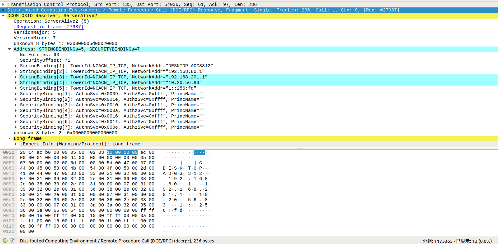
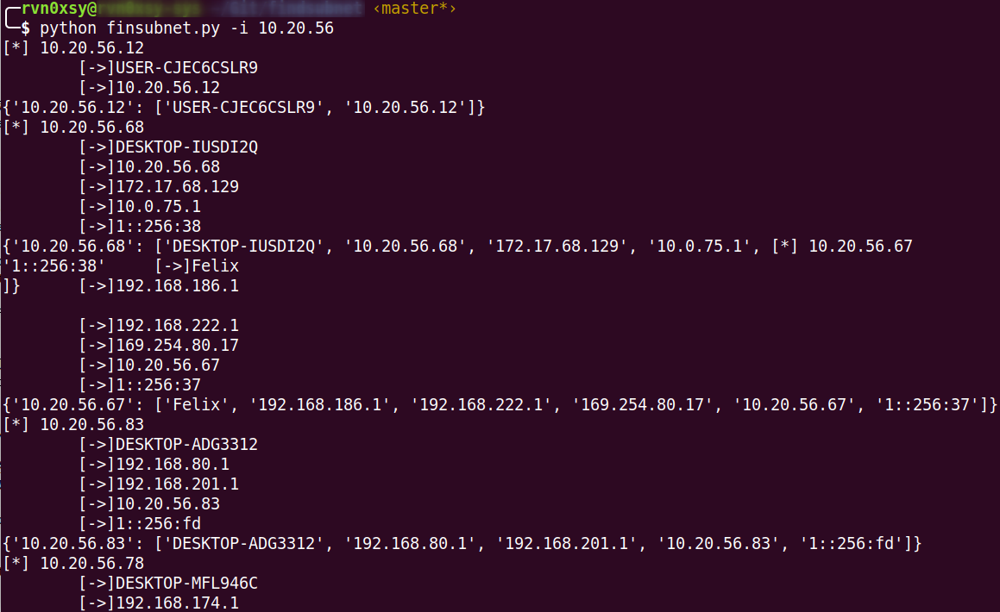

## 0x00 背景

Nicolas Delhaye在AIRBUS上分享了一篇[The OXID Resolver [Part 1] – Remote enumeration of network interfaces without any authentication](https://airbus-cyber-security.com/the-oxid-resolver-part-1-remote-enumeration-of-network-interfaces-without-any-authentication/)，通过这篇文章我们可以掌握通过Windows的一些DCOM接口进行网卡进行信息枚举，它最大的魅力在于无需认证，只要目标的135端口开放即可获得信息。

## 0x01 OXID Resolver - 交互过程分析

OXID Resolver是在支持COM +的每台计算机上运行的服务。

它执行两项重要职责：

- 它存储与远程对象连接所需的RPC字符串绑定，并将其提供给本地客户端。
- 它将ping消息发送到本地计算机具有客户端的远程对象，并接收在本地计算机上运行的对象的ping消息。OXID解析器的此方面支持COM +垃圾回收机制。

Nicolas Delhaye在原文提供的脚本是需要依赖imapcket的，而我只关注在Socket RAW上的实现，这样能够减小工具的体积，并且其他语言也能够轻松复刻整个过程。

这个协议Wireshark已经内置了，我们可以直接进行抓包分析。


前三个不需要关注，主要是TCP的三次握手，后面的四次交互才是我们需要重点关注的。

第一个数据包 72 Bytes （主要用于协商版本等等）：


```
\x05\x00\x0b\x03\x10\x00\x00\x00\x48\x00\x00\x00\x01\x00\x00\x00\xb8\x10\xb8\x10\x00\x00\x00\x00\x01\x00\x00\x00\x00\x00\x01\x00\xc4\xfe\xfc\x99\x60\x52\x1b\x10\xbb\xcb\x00\xaa\x00\x21\x34\x7a\x00\x00\x00\x00\x04\x5d\x88\x8a\xeb\x1c\xc9\x11\x9f\xe8\x08\x00\x2b\x10\x48\x60\x02\x00\x00\x00
```

第二个数据包：

这个包无需关注，因为我们最终要获得的是第四个数据包。

```
"\x05\x00\x0c\x03\x10\x00\x00\x00\x3c\x00\x00\x00\x01\x00\x00\x00" \
"\xb8\x10\xb8\x10\x0a\x13\x00\x00\x04\x00\x31\x33\x35\x00\x00\x00" \
"\x01\x00\x00\x00\x00\x00\x00\x00\x04\x5d\x88\x8a\xeb\x1c\xc9\x11" \
"\x9f\xe8\x08\x00\x2b\x10\x48\x60\x02\x00\x00\x00"
```

可以选中对应的节点，直接复制`... as Escaped String`，这样就能够拿到十六进制Code。

第三个数据包：

```
"\x05\x00\x00\x03\x10\x00\x00\x00\x18\x00\x00\x00\x01\x00\x00\x00" \
"\x00\x00\x00\x00\x00\x00\x05\x00"
```

第四个数据包：

```
"\x05\x00\x02\x03\x10\x00\x00\x00\xec\x00\x00\x00\x01\x00\x00\x00" \
"\xd4\x00\x00\x00\x00\x00\x00\x00\x05\x00\x07\x00\x00\x00\x02\x00" \
"\x5d\x00\x00\x00\x5d\x00\x47\x00\x07\x00\x44\x00\x45\x00\x53\x00" \
"\x4b\x00\x54\x00\x4f\x00\x50\x00\x2d\x00\x41\x00\x44\x00\x47\x00" \
"\x33\x00\x33\x00\x31\x00\x32\x00\x00\x00\x07\x00\x31\x00\x39\x00" \
"\x32\x00\x2e\x00\x31\x00\x36\x00\x38\x00\x2e\x00\x38\x00\x30\x00" \
"\x2e\x00\x31\x00\x00\x00\x07\x00\x31\x00\x39\x00\x32\x00\x2e\x00" \
"\x31\x00\x36\x00\x38\x00\x2e\x00\x32\x00\x30\x00\x31\x00\x2e\x00" \
"\x31\x00\x00\x00\x07\x00\x31\x00\x30\x00\x2e\x00\x32\x00\x30\x00" \
"\x2e\x00\x35\x00\x36\x00\x2e\x00\x38\x00\x33\x00\x00\x00\x07\x00" \
"\x31\x00\x3a\x00\x3a\x00\x32\x00\x35\x00\x36\x00\x3a\x00\x66\x00" \
"\x64\x00\x00\x00\x00\x00\x09\x00\xff\xff\x00\x00\x1e\x00\xff\xff" \
"\x00\x00\x10\x00\xff\xff\x00\x00\x0a\x00\xff\xff\x00\x00\x16\x00" \
"\xff\xff\x00\x00\x1f\x00\xff\xff\x00\x00\x0e\x00\xff\xff\x00\x00" \
"\x00\x00\x00\x00\x00\x00\x00\x00\x00\x00\x00\x00"
```



第四个数据包返回的永远是不定长的数据，所以需要参考文档进行解析，我下载了一份包含了OXID的文档，看起来非常的吃力，虽然有结构体，但是并没有给出一个通用的解决方案。

## 0x03 数据解析过程

规律：

- 每一个String Binding都以`\x07\x00`开头。
- 每一个StringBinding都以`\x00\x00`分割，一直到第一个Security Binding是`\x09\x00`开头。

因此，当recv的数据直到`\x09\x00`结束，开头就比较好办了，第四个数据包起始位置往后偏移42个字节就可以到达第一个String Binding。

代码如下：

```py
packet_v2 = packet[42:]
packet_v2_end = packet_v2.find("\x09\x00\xff\xff\x00\x00")
packet_v2 = packet_v2[:packet_v2_end]
hostname_list = packet_v2.split("\x00\x00")
result = {ip:[]}
print("[*] " + ip)
for h in hostname_list:
    h = h.replace('\x07\x00','')
    h = h.replace('\x00','')
    if h == '':
        continue
    print("\t[->]" + h)
    result[ip].append(h)
print result
```

## 0x04 多线程实现效果



优点：

- 不依赖impacket

通过本文的分析，可以有效提高内网渗透的效率，定位多网卡主机，同时可以复刻这个方法来实现其他语言的版本。

Github 源代码地址：https://github.com/Rvn0xsy/OXID-Find/

