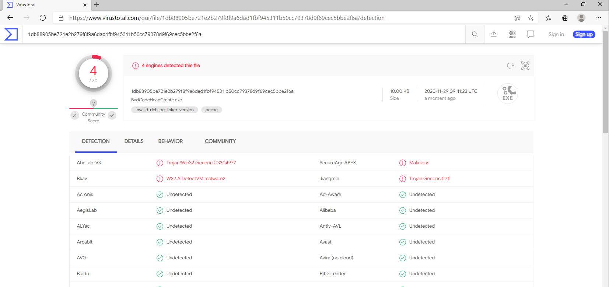

代码将会上传至Github，方便读者下载研究 : https://github.com/Rvn0xsy/BadCode

## 0x01 数据执行保护（DEP）

DEP(Data Execution Prevention)即“ 数据执行保护”，这是Windows的一项安全机制，主要用来防止病毒和其他安全威胁对系统造成破坏。 微软从Windows XP SP2引入了该技术，并一直延续到今天。

### 为什么要有DEP

在Windows Xp SP2 之前的时代，缓冲区溢出漏洞利用门槛太低了，只要发现有缓冲区溢出漏洞，就可以直接稳定利用，攻击者只需要将Shellcode不断写入堆栈，然后覆盖函数返回地址，代码就可以在堆栈中执行。但堆栈的用途主要是保存寄存器现场，提供一个函数运行时的存储空间，极少数需要代码在堆栈中执行，于是微软为了缓解类似的情况，发明了DEP保护机制，用于限制某些内存页不具有可执行权限。

## 0x02 如何绕过DEP

`VirtualProtect`这个API能够更改内存页的属性为可执行或不可执行，对于二进制漏洞利用来说，溢出的时候，把返回地址设计为`VirtualProtect`的地址，再精心构造一个栈为调用这个API的栈，就可以改变当前栈的内存页的属性，使其从"不可执行"变成"可执行"。

## 0x03 举一反三

由此说来，Shellcode执行其实也需要一个可执行的内存页，那么还有哪些API能够构造一个可执行的内存页呢？

`HeapCreate`可以在进程中创建辅助堆栈，并且能够设置堆栈的属性：

```c
HANDLE WINAPI HeapCreate(
__in DWORD flOptions,
__in SIZE_T dwInitialSize,
__in SIZE_T dwMaximumSize );
```

第一个参数`flOptions`用于修改如何在堆栈上执行各种操作。
你可以设定`0`、`HEAP_NO_SERIALIZE`、`HEAP_GENERATE_EXCEPTIONS`、`HEAP_CREATE_ENABLE_EXECUTE`或者是这些标志的组合。


- `HEAP_NO_SERIALIZE`：对堆的访问是非独占的，如果一个线程没有完成对堆的操作，其它线程也可以进程堆操作，这个开关是非常危险的，应尽量避免使用。
- `HEAP_GENERATE_EXCEPTIONS`：当堆分配内存失败时，会抛出异常。如果不设置，则返回NULL。
- `HEAP_CREATE_ENALBE_EXECUTE`：堆中存放的内容是可以执行的代码。如果不设置，意味着堆中存放的是不可执行的数据。

看到`HEAP_CREATE_ENALBE_EXECUTE`相信很多人能够恍然大悟，我们的Shellcode可以存入这个辅助堆栈中，然后创建一个线程运行它即可。

## 0x04 Shellcode执行

```c++
#include <iostream>
#include <Windows.h>

int main()
{
	char shellcode[] = "123";

	HANDLE hHep = HeapCreate(HEAP_CREATE_ENABLE_EXECUTE | HEAP_ZERO_MEMORY, 0, 0);

	PVOID Mptr = HeapAlloc(hHep, 0, sizeof(shellcode));

	RtlCopyMemory(Mptr, shellcode, sizeof(shellcode));
	DWORD dwThreadId = 0;
	HANDLE hThread = CreateThread(NULL, NULL, (LPTHREAD_START_ROUTINE)Mptr, NULL, NULL, &dwThreadId);
	WaitForSingleObject(hThread, INFINITE);

    std::cout << "Hello World!\n";
}
```

上方的例子中，我将shellcode替换为了其他字符串，因为我觉得shellcode混淆是另外一回事。




> 样本链接：https://www.virustotal.com/gui/file/1db88905be721e2b279f8f9a6dad1fbf945311b50cc79378d9f69cec5bbe2f6a/detection
