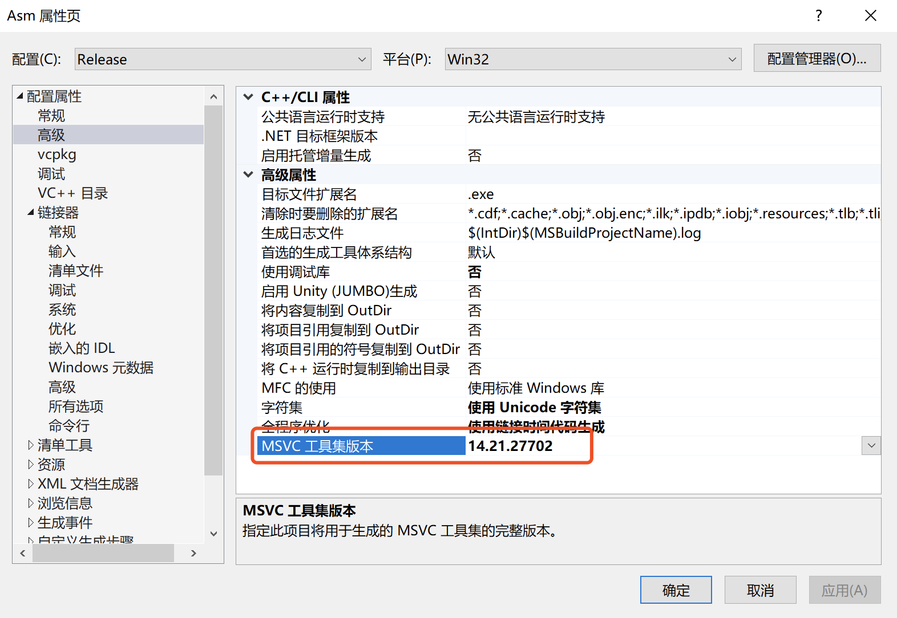
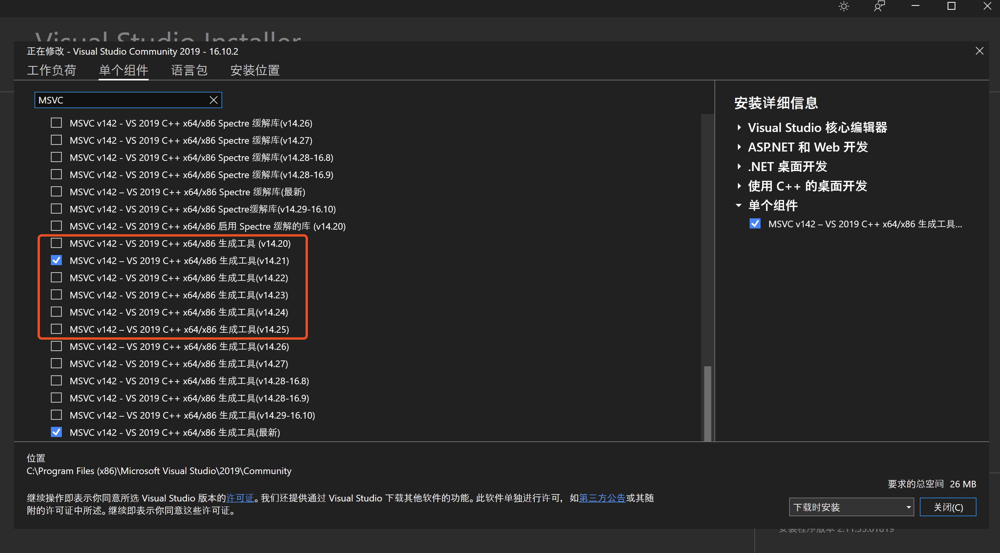
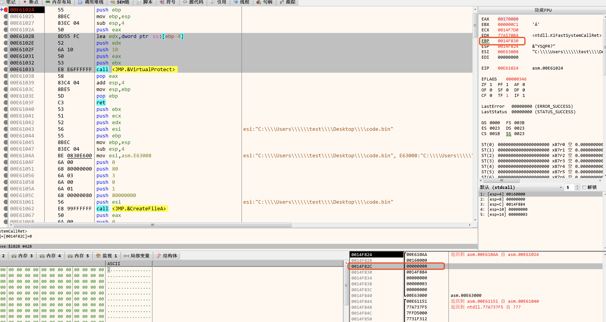
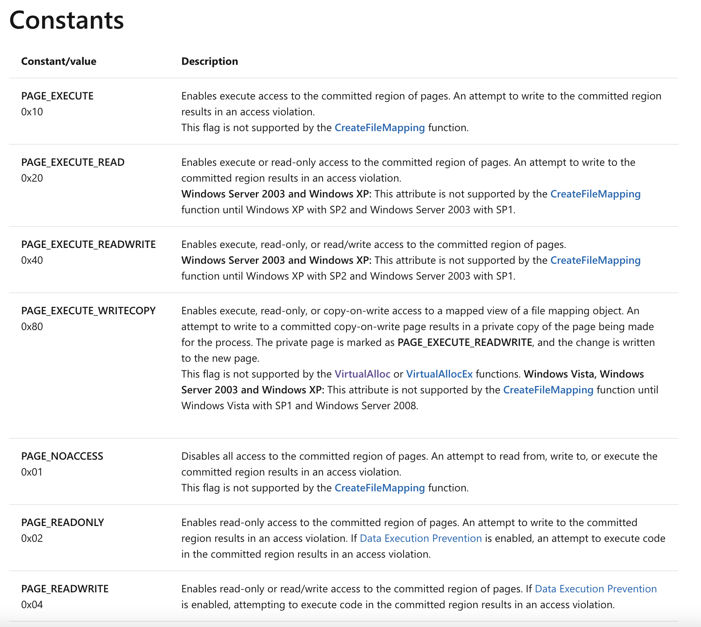

## 0x00 调用约定

[__stdcall](https://docs.microsoft.com/en-us/cpp/cpp/stdcall?view=msvc-160)关键字用于约定调用Win32 API函数的参数入栈顺序，它的入栈顺序是由右向左，一般C/C++语言代码中没有声明调用约定的话，默认就是`__stdcall`调用约定。

C++中如果要声明函数的调用约定，可以通过以下格式：

```C++
void __stdcall CMyClass::mymethod() { 
    return; 
}
```

## 0x01 栈与调用约定的关系

提到栈，这已经是计算机知识体系里面老生常谈的技术了，并且互联网上已经有大量的文章去讲解栈的工作机制。

下面说说我对栈的理解：

* 函数调用离不开栈
* 栈用于完整保留调用前CPU的状态值，堆用于保留临时变量，实现了在函数体内部共享内存
* 栈溢出一般是由于局部变量填满了栈的空间，没有及时释放，导致溢出，比如递归`stack overflow`
* 栈遵循先入后出的原则
* .....

写一段汇编：

```
push 10h ; 代表第 1 个参数
push 20h ; 代表第 2 个参数
pop eax ; eax = 20h
pop ebx ; ebx = 10h
```

栈遵循先入后出的原则，栈顶ESP是低地址，栈底EBP是高地址。


## 0x02 使用汇编调用Win32 API

环境：Visual Studio 2019 （MSVC工具集版本14.26以下）

MSVC工具集版本14.26以下才能够编译MASM正常调用Win32 API的代码，这里我使用的是`14.21.27702`。



### 安装低版本MSVC工具集版本

打开Visual Studio Installer，点击`修改`：



红框内的工具集版本都支持正常编译。

### MASM INVOKE

32位模式中，可以用Microsoft的INVOKE、PROTO 和扩展 PROC 伪指令新建多模块程序。与更加传统的CALL和EXTERN相比，它们的主要优势在于：能够将INVOKE传递的参数列表与PROC声明的相应列表进行匹配。

INVOKE方便了我们将参数与官方文档的API的参数顺序进行对应，例如在MASM汇编中调用MessageBox函数：

```assembly
.686
.model flat, stdcall
include windows.inc
includelib user32.lib
includelib kernel32.lib
.data
title db "Hello,World",0
buf db "Message....",0
.code
start:
INVOKE MessageBox, NULL, addr buf, addr title, MB_OK
end stat
```

如果要转为纯汇编的方式，就要手动压栈了：

```assembly
.686
.model flat, stdcall
include windows.inc
includelib user32.lib
includelib kernel32.lib
.data
title db "Hello,World",0
buf db "Message....",0
.code
start:
push MB_OK
push addr title
push addr buf
push NULL
call MessageBox
end start
```

## 0x03 自定义函数分析调用过程

实现功能：将某块内存设置为可执行属性

涉及Windows API：

```C++
BOOL VirtualProtect(  
  LPVOID lpAddress,  
  DWORD dwSize,  
  DWORD flNewProtect,  
  PDWORD lpflOldProtect  
);
```

部分汇编代码：

```assembly
; edx = lpflOldProtect
; eax = lpAddress
; ebx = dwSize
AddExecutePage PROC
    push ebp
    mov ebp,esp
    sub esp,4
    push eax ; 
    lea edx,dword ptr ds:[ebp-4]
    invoke VirtualProtect,ebx,eax,PAGE_EXECUTE,edx
    pop eax
    add esp,4
    mov esp,ebp
    pop ebp
    ret
AddExecutePage ENDP
```

`AddExecutePage`是我自己在项目中定义个一个过程，其中寄存器的状态值已经给出，经过调试我发现INVOKE调用VirtualProtect的参数传递顺序和Windows API文档存在差异，就是`dwSize`与`lpAddress`的顺序不一样。

按常理来讲，最先入栈的数据是函数最右边的参数，入栈顺序是：

```assembly
push lpflOldProtect
push flNewProtect
push dwSize
push lpAddress
call VirtualProtect
```

但事实情况是：

```assembly
push lpflOldProtect
push flNewProtect
push lpAddress
push dwSize
call VirtualProtect
```

调试一下看看情况


此时`EAX = 0x00170000`指向了要改变属性的内存地址，但第一个`push eax`并不是开始给`VirtualProtect`传递参数，而是从`call`往上数四个`push`指令，这些`push`的数据才是`VirtualProtect`的参数。

```assembly
00E6102B   | 8D55 FC         | lea edx,dword ptr ss:[ebp-4]                   |
00E6102E   | 52              | push edx                                       |
00E6102F   | 6A 10           | push 10                                        |
00E61031   | 50              | push eax                                       |
00E61032   | 53              | push ebx                                       |
00E61033   | E8 E6FFFFFF     | call <JMP.&VirtualProtect>                     |
```

`lea edx,dword ptr ss:[ebp-4]`代表把ebp-4的地址复制给edx，`EBP=0014F830`，`0014F830-4=0014F82C`，那么`edx=0014F82C`，下一句`push edx`作为`VirtualProtect`的第一个参数`lpflOldProtect`传递进去。

注：`lpflOldProtect`的数据类型是`PDWORD`，也就是DWORD的指针，传指针而非传递值。




第二个`push 10`，代表了`flNewProtect`，0x10代表了[内存属性常量](https://docs.microsoft.com/en-us/windows/win32/memory/memory-protection-constants)`PAGE_EXECUTE`。




第三个`push eax`，代表了`lpAddress`，指向要改变的内存地址。

第四个`push ebx`，代表了`dwSize`，ebx的值是`000000C1`，说明要改变内存属性的内存大小是0xC1个字节。

其中，第三个push和第四个push的顺序按照函数声明的格式是先传递大小，后传递内存地址的，经过分析，我发现必须先传递内存地址后传递大小才能正常执行。

继续跟入后，发现会通过VirtualProtect调用VirtualProtectEx。

```assembly
75CC22C0   | 8BEC            | mov ebp,esp                                    |
75CC22C2   | FF75 14         | push dword ptr ss:[ebp+14]                     |
75CC22C5   | FF75 10         | push dword ptr ss:[ebp+10]                     |
75CC22C8   | FF75 0C         | push dword ptr ss:[ebp+C]                      |
75CC22CB   | FF75 08         | push dword ptr ss:[ebp+8]                      |
75CC22CE   | 6A FF           | push FFFFFFFF                                  |
75CC22D0   | E8 09000000     | call <kernelbase.VirtualProtectEx>             |
```


```C++
BOOL VirtualProtectEx(
  HANDLE hProcess,
  LPVOID lpAddress,
  SIZE_T dwSize,
  DWORD  flNewProtect,
  PDWORD lpflOldProtect
);
```
按照函数声明，从右向左对应入栈值：

* `lpflOldProtect -> 0x14F820`
* `flNewProtect -> 0x10`
* `dwSize -> 0x170000`
* `lpAddress -> 0xC1`
* `hProcess -> FFFFFFFF`

这个时候发现`VirtualProtectEx`的顺序也有问题，理想情况下应该是：

* `lpflOldProtect -> 0x14F820`
* `flNewProtect -> 0x10`
* `dwSize -> 0xC1`
* `lpAddress -> 0x170000`
* `hProcess -> FFFFFFFF`

## 0x04 结论

测试通过Windows 10、Windows 7以后，我最终的解决办法还是要把`dwSize`和`lpAddress`的入栈顺序进行调换，发现程序可以正常运行。

