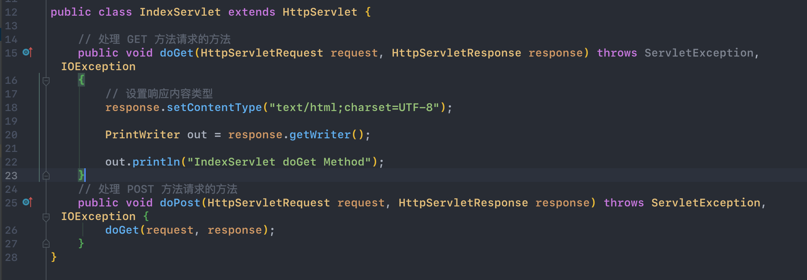

## 0x00 Java Servlet API 之 Filter

Filter，字面意思有过滤的意思，其实在Servlet API中，它就是充当了一个过滤器，2000年，Sun公司在Servlet 2.3规范中添加了Filter功能，并在Servlet 2.4中对Filter进行了细节上的补充。每一个Java Servlet Web都可以设置多个Filter，开发人员可以通过`web.xml`配置Filter的过滤范围。Filter的实现主要通过Servlet API中提供的Filter接口定义的方法，其实就三个方法。

```java
public interface Filter {
    void init(FilterConfig var1) throws ServletException;
    // 对Filter进行初始化，可以通过FilterConfig对象读取web.xml中的<init-param></init-param>
    // init只会在Web服务启动时执行1次
    void doFilter(ServletRequest var1, ServletResponse var2, FilterChain var3) throws IOException, ServletException; 
    // Filter主要的过滤方法实现，主要是对不同的请求做不同的动作，ServletRequest对象可以转换为HttpServletRequest

    void destroy(); 
    // Filter执行完毕所要做的操作可以在这个函数中实现
    // destroy只会在Web服务停止时执行1次
}
```

## 0x01 Filter中的FilterChain

通常开发人员会使用`web.xml`来配置当前站点的各种信息，例如：Servlet、Filter、Listener、显示名称、描述...等其他信息，关于web.xml的格式定义，oracle官方有一个[非常详细的说明](https://docs.oracle.com/cd/E13222_01/wls/docs81/webapp/web_xml.html)。

假设漏洞环境中的web.xml定义了分别有`LoaderFilter`、`StaticFilter`，都在`com.web.`包下：

```xml
<!DOCTYPE web-app PUBLIC
 "-//Sun Microsystems, Inc.//DTD Web Application 2.3//EN"
 "http://java.sun.com/dtd/web-app_2_3.dtd" >

<web-app>
  <display-name>Archetype Created Web Application</display-name>

  <filter>
    <filter-name>LoaderFilter</filter-name>
    <filter-class>com.web.LoaderFilter</filter-class>
  </filter>

  <filter>
    <filter-name>StaticFilter</filter-name>
    <filter-class>com.web.StaticFilter</filter-class>
    <init-param>
      <param-name>excludedPaths</param-name>
      <param-value>.html,.js,.ico,.css,.jpg,.png,.gif</param-value>
    </init-param>
  </filter>

  <filter-mapping>
    <filter-name>StaticFilter</filter-name>
    <url-pattern>/*</url-pattern>
  </filter-mapping>

  <filter-mapping>
    <filter-name>LoaderFilter</filter-name>
    <url-pattern>/*</url-pattern>
  </filter-mapping>

</web-app>
```

FilterChain：Filter由于URL的匹配模式设置会形成一条链，最先由第一个符合URL匹配的Filter先执行doFilter，在doFilter中可以根据获得的ServletRequest、ServletResponse、FilterChain进行其他动作，当doFilter中调用FilterChain的doFilter方法时，其实就是将ServletRequest、ServletResponse继续传给下一个Filter对象，这样就形成了一个链式结构，如果直接在doFilter中进行`return`或不掉用FilterChain的doFilter，那么ServletRequest、ServletResponse就不会继续流向下一个Filter。

上面的配置文件表示了StaticFilter、LoaderFilter都覆盖了所有的URL，但是StaticFilter要比LoaderFilter优先，最先映射的优先级越高，在StaticFilter的doFilter方法中调用FilterChian.doFilter才会继续执行LoaderFilter.doFilter。

## 0x02 静态资源文件的Filter

一般情况下网站拥有许多静态资源是前台与后台公用的，例如jquery这种js库文件前后台都需要使用，但后台与前台也要做权限区分，不能让用户在未授权的情况下还能访问登录管理员的接口，因此需要编写一个优先级较高的Filter将URL中以静态资源文件扩展名结尾的资源进行提前放行，如果不是静态资源则让他跳转到登录页面。

上面的StaticFilter就是简单实现了这个功能：

```java
package com.web;

import javax.servlet.*;
import java.io.IOException;
import java.lang.reflect.Method;
import javax.servlet.Filter;
import javax.servlet.FilterChain;
import javax.servlet.FilterConfig;
import javax.servlet.ServletException;
import javax.servlet.ServletRequest;
import javax.servlet.ServletResponse;
import javax.servlet.http.HttpServletRequest;
import javax.servlet.http.HttpServletResponse;

public class StaticFilter implements Filter {
    private String excludedPaths;
    private String [] excludedPathArray;
    private FilterConfig filterConfig;
    private String [] excludedExt;

    @Override
    public void init(FilterConfig filterConfig) throws ServletException {
        this.filterConfig = filterConfig;
        System.out.println("StaticFilter Init....");
        this.excludedPaths = this.filterConfig.getInitParameter("excludedPaths");
        this.excludedExt = this.excludedPaths.split(",");
    }

    private boolean isContains(String container, String[] regx) {
        boolean result = false;
        for (String r: regx){
            if (container.contains(r)) {
                result =true;
                break;
            }
        }
        return result;
    }

    @Override
    public void doFilter(ServletRequest request, ServletResponse response, FilterChain chain) throws RuntimeException,IOException,ServletException {
        HttpServletRequest httpServletRequest = (HttpServletRequest)request;
        System.out.println(httpServletRequest.getRequestURI());
        System.out.println("------Static------");
        if (this.isContains(httpServletRequest.getRequestURI(), excludedExt)){
            response.getWriter().write("YES");
        }
        chain.doFilter(request, response);
    }

    @Override
    public void destroy() {

    }
}
```

上面的代码仅仅是模拟了访问静态资源会让页面响应YES，如果URL的扩展名中不是excludedExt其中的某一个，那么页面不会响应YES。其实Filter微小的配置改动有时候能产生巨大的影响，包括其中也漏洞挖掘的利用条件。

## 0x03 Filter中的反射

这个是审计某个系统的看到的大致代码，觉得非常有意思，开发者在单独的一个Servlet中实现了一个反射的功能用于随时调用框架内的任意对象方法，这里我模拟成在LoaderFilter中实现。

```java
package com.web;

import javax.servlet.*;
import java.io.IOException;
import java.lang.reflect.Method;
import javax.servlet.Filter;
import javax.servlet.FilterChain;
import javax.servlet.FilterConfig;
import javax.servlet.ServletException;
import javax.servlet.ServletRequest;
import javax.servlet.ServletResponse;
import javax.servlet.http.HttpServletRequest;
import javax.servlet.http.HttpServletResponse;

public class LoaderFilter implements Filter {

    @Override
    public void init(FilterConfig filterConfig) throws ServletException {

        System.out.println("LoaderFilter Init....");
    }

    @Override
    public void doFilter(ServletRequest request, ServletResponse response, FilterChain chain) throws RuntimeException, IOException,ServletException {
        HttpServletRequest httpServletRequest = (HttpServletRequest)request;
        System.out.println(httpServletRequest.getRequestURI());
        System.out.println("------Loader------");
        String className = request.getParameter("class");
        String methodName = request.getParameter("method");
        if (className == null || methodName == null){
            System.out.println("No Class");
            chain.doFilter(request, response);
            return;
        }

        try{
            System.out.println(className);
            Class servletObj = Class.forName(className);
            Method servletMethod = servletObj.getMethod(methodName,HttpServletRequest.class, HttpServletResponse.class);
            servletMethod.invoke(servletObj.newInstance(),request,response);
        }catch (Exception e){
            System.out.println(e.toString());
        }
    }

    @Override
    public void destroy() {

    }
}
```

LoaderFilter的doFilter主要功能是从HttpServletRequest对象中拿到class、method两个参数，然后将class的值当作对象的名称，对其进行反射加载，调用method方法。其实根据参数类型可以看出，LoaderFilter主要是为了可以调用某个符合Servlet方法的对象。

## 0x04 利用静态资源Filter绕过权限检测进行任意对象的反射

了解清楚Filter的过滤过程，那么就可以利用StaticFilter满足在为授权的情况下，调用LoaderFilter去执行任意Servlet对象的doGet、doPost方法，如果某个Servlet的方法存在漏洞，就可以达到完美利用。

构造URL：http://localhost/MyWeb_war/test.css?class=com.web.IndexServlet&method=doGet



执行效果：


## 0x05 文件解压缩目录穿越问题

许多时候一些Java Web开发者对于压缩包内的文件名可信程度非常高，这就出现了许多由非常规压缩文件名导致的路径穿越漏洞，很多办公类的系统好像大多都有类似问题，危害其实最大的是利用路径穿越解压功能（其实就是任意目录写）可以让Webshell写入到一个能够执行的目录。

常见的库：
```java
import org.apache.tools.zip.ZipEntry;  
import org.apache.tools.zip.ZipFile;  
import org.apache.tools.zip.ZipOutputStream; 
```

危险的写法：

```java
public void unZip(String srcFile,String dest,boolean deleteFile)  throws Exception {  
        File file = new File(srcFile);  
        if(!file.exists()) {  
            throw new Exception("解压文件不存在!");  
        }  
        ZipFile zipFile = new ZipFile(file);  
        Enumeration e = zipFile.getEntries();  
        while(e.hasMoreElements()) {  
            ZipEntry zipEntry = (ZipEntry)e.nextElement();  
            if(zipEntry.isDirectory()) {  
                String name = zipEntry.getName();  
                name = name.substring(0,name.length()-1);  
                File f = new File(dest + name);  
                f.mkdirs();  
            } else {  
                File f = new File(dest + zipEntry.getName()); // 重点是这一行，zipEntry.getName() 获取的文件名并不可信。 
                f.getParentFile().mkdirs();  
                f.createNewFile();  
                InputStream is = zipFile.getInputStream(zipEntry);  
                FileOutputStream fos = new FileOutputStream(f);  
                int length = 0;  
                byte[] b = new byte[1024];  
                while((length=is.read(b, 0, 1024))!=-1) {  
                    fos.write(b, 0, length);  
                }  
                is.close();  
                fos.close();  
            }  
        }  
          
        if (zipFile != null) {  
            zipFile.close();  
        }  
          
        if(deleteFile) {  
            file.deleteOnExit();  
        }  
    }  
```

ZipCreater主要应用于跨目录的文件上传漏洞的利用，它能够快速进行压缩包生成，[evilarc.py](https://github.com/ptoomey3/evilarc/blob/master/evilarc.py)不支持修改已有的压缩包，但ZipCreater可以。

假设/tmp/payload文件夹内的文件列表如下：

```java
zipEntry.getName() =>1.txt
zipEntry.getName() =>2.txt
zipEntry.getName() =>shell.jsp
```

使用ZipCreater可以生成跨目录的文件名：

```bash
$ zipcreater -source /tmp/payload/ -dest /tmp/exploit.zip -filename shell.jsp -path ../../../webshell.jsp'
```

exploit.zip内容如下：

```java
zipEntry.getName() => 1.txt
zipEntry.getName() => 2.txt
zipEntry.getName() => ../../../webshell.jsp
```

